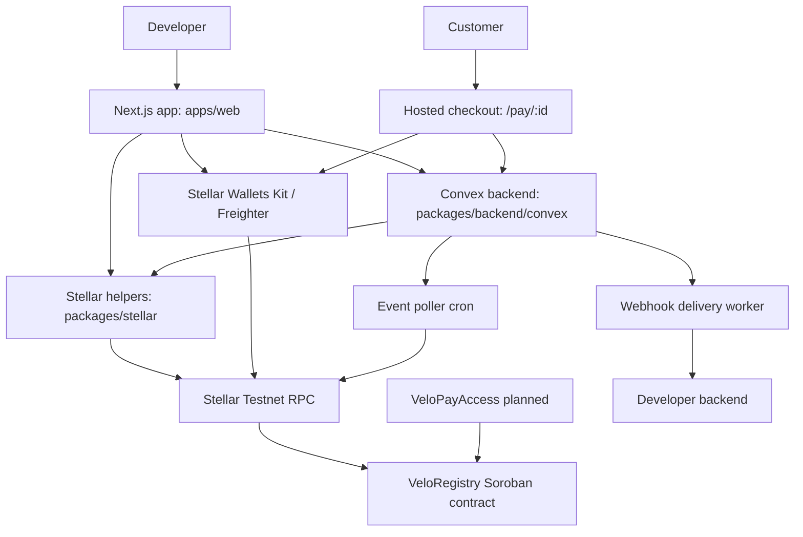

# Velo

**Developer-first stablecoin payment infrastructure and verification tooling for Stellar builders.**

Velo helps Stellar and Soroban teams register verified projects, link official contracts, debug transactions, monitor contract events, and receive webhook notifications. The current codebase implements the Phase 1 **Verify + Debug** foundation. The Alpha roadmap extends that foundation into **Velo Pay**: hosted payment links, checkout helpers, payment status tracking, and payment webhooks for stablecoin payments on Stellar Testnet.


## Problem

Stellar developers often need to build the same production support systems before they can ship a trustworthy app:

- A way to prove which contracts are official for a project.
- A dashboard for project registration, metadata, and owner-controlled contract lists.
- Transaction debugging that explains Soroban failures without digging through raw RPC responses.
- Event monitoring for registered contracts.
- Webhook delivery so app backends can react to on-chain activity.
- Payment flows that let customers pay with stablecoins without every team rebuilding checkout, transaction confirmation, and status tracking.

Velo packages these workflows into one developer platform for Stellar projects.

## Product Direction

Velo started as a verified project registry and developer observability tool. The Alpha plan now prioritizes **Velo Pay**, a stablecoin payment layer for Stellar:

> Velo Pay lets Stellar developers accept stablecoin payments with a payment link, a few lines of SDK code, and real-time webhooks when payments succeed.

The long-term product combines:

- Verified project and merchant identity anchored by Soroban contracts.
- Official contract linking to reduce spoofing and improve user trust.
- Payment links and hosted checkout for Stellar stablecoin payments.
- Transaction and payment debugging.
- Event and webhook infrastructure for developer backends.
- Dashboard tooling that works for solo builders, hackathon teams, and early-stage apps.

## Target Users

- Stellar smart contract developers.
- Soroban builders and hackathon teams.
- Stablecoin payment app developers.
- SaaS teams that need wallet-based checkout.
- DeFi and remittance builders that need payment confirmation webhooks.
- Wallet and infrastructure teams that need project verification and event visibility.

## Current Implementation Status

As of `2026-06-29`, Velo is **Phase 1 MVP implemented** and **Alpha Pay in planning/implementation scope**.

Implemented and locally verified:

- Wallet connection flow for Stellar Testnet through Stellar Wallets Kit.
- Convex-backed project dashboard and project creation flow.
- Soroban `VeloRegistry` contract with integration tests.
- On-chain project registration transaction builder and sync flow.
- Official contract add/remove flow.
- Public verified project page at `/verify/[slug]`.
- Transaction hash debugger backed by Stellar RPC and Convex cache.
- Bounded contract event polling for registered project contracts.
- Webhook configuration, test delivery, delivery logs, and automatic event hooks.
- Project API key generation with hashed storage.
- Read-only developer API routes for events, cached transactions, and webhook deliveries.

Not Alpha-complete yet:

- `VeloPayAccess` or `VeloAccessPass` second contract.
- Inter-contract call from payment access contract into `VeloRegistry`.
- PaymentIntent system.
- Hosted payment links and checkout page.
- Checkout SDK or copy-paste checkout helper.
- Payment confirmation workflow and `payment.succeeded` webhook.
- Webhook HMAC signing and secret generation.
- API key usage tracking, revocation metadata, request counts, and rate limiting.
- Full RPC gateway.
- Testnet deployment IDs and full live demo validation.

## Implemented Features

### Wallet Connection

The web app initializes Stellar Wallets Kit in the browser and targets Stellar Testnet.

Supported states include:

- Not connected.
- Connecting.
- Connected.
- Connection rejected.
- Wallet unavailable.
- Unsupported or stale wallet session.
- Disconnect.

The wallet provider exposes `connect`, `disconnect`, and `signTransaction` for project registration and contract management flows.

### Project and Merchant Dashboard

Developers can create and manage Velo projects in the dashboard.

Current behavior:

- Owner-wallet-scoped project list.
- Draft project creation.
- Slug generation.
- Metadata JSON preview.
- SHA-256 metadata hash generation.
- Project status tracking: `draft`, `pending_registration`, `registered`, `registration_error`, and `stale`.
- Dashboard loading and empty states.

The project model is wallet-first. Ownership checks compare the connected/submitted wallet address against the stored owner wallet. Full account auth is outside the current MVP scope.

### Soroban Registry Contract

`contracts/registry` contains the Rust Soroban `VeloRegistry` contract.

Implemented contract functions:

```txt
register_project(owner, name, metadata_hash) -> u64
update_project(project_id, metadata_hash)
add_contract(project_id, contract_id)
remove_contract(project_id, contract_id)
transfer_ownership(project_id, new_owner)
deactivate_project(project_id)
get_project(project_id) -> Option<Project>
get_project_contracts(project_id) -> Vec<Address>
```

Contract behavior:

- Owner mutations require `owner.require_auth()`.
- Project metadata is anchored with a 32-byte hash.
- Contract IDs are deduplicated per project.
- Each project can link up to 25 official contracts.
- Registry mutations emit on-chain events.
- Persistent storage TTL is extended.
- Rust integration tests cover registration, ownership, duplicate checks, contract limits, inactive project behavior, transfer, missing project errors, emitted events, and non-owner rejection.

### On-Chain Registration Flow

The app can build, sign, submit, and sync a `register_project` transaction.

Current flow:

```txt
Developer creates project draft
    |
Developer connects Testnet wallet
    |
Web app builds Soroban register_project transaction
    |
Wallet signs transaction
    |
Signed XDR is submitted to Stellar RPC
    |
Convex stores pending transaction hash
    |
Sync confirms transaction and stores on-chain project data
```

Live Testnet validation still depends on deploying and configuring `NEXT_PUBLIC_VELO_REGISTRY_CONTRACT_ID`.

### Official Contract Management

Registered projects can add and remove official Soroban contract IDs.

Current behavior:

- Add official contract transaction builder.
- Remove official contract transaction builder.
- Wallet signing and Stellar RPC submission.
- Pending, active, stale, and error states in Convex.
- Duplicate prevention in backend and contract layers.
- Owner-scoped contract listing.
- Copy actions and removal confirmation.

### Public Verification Page

The route `/verify/[slug]` provides a wallet-free public page for each project.

It displays:

- Project name and description.
- Owner wallet.
- Verification status.
- Registry project ID.
- Metadata hash.
- Created ledger.
- Last sync time.
- Official contract IDs.
- Recent public activity from indexed events.

It intentionally does not expose private webhook URLs, raw API keys, delivery internals, or raw event payloads.

### Transaction Debugger

The debugger accepts 64-character Stellar transaction hashes and fetches transaction details through Stellar RPC.

Current behavior:

- Transaction hash validation.
- RPC-backed lookup.
- Convex caching.
- Status, ledger, fee, operation, and contract invocation details.
- Resource and fee inspection.
- Human-readable hints for common failure modes.

XDR-first debugging and advanced visual traces are deferred.

### Contract Event Monitor

Velo indexes events only for contracts linked to registered projects.

Current behavior:

- Bounded background polling through Convex cron/actions.
- Stellar RPC `getEvents` usage.
- Project and contract-linked event storage.
- Dashboard filtering and event inspection.
- Recent public activity on verification pages.

Velo does not attempt to index the full Stellar network.

### Webhooks and Developer API

Velo supports project webhooks and read-only API routes for developer integrations.

Current behavior:

- Webhook URL configuration.
- Enable/disable support.
- Test webhook delivery.
- Delivery attempt logs.
- Automatic triggers for project, contract, transaction, and contract-event workflows.
- API key generation with SHA-256 hashed storage.

Current API routes:

```txt
GET /api/v1/events
GET /api/v1/transactions/[hash]
GET /api/v1/webhooks/deliveries
```

Deferred hardening:

- HMAC webhook signing.
- Webhook secret generation.
- Retry policy.
- API key request counts.
- Last-used timestamps.
- Rate limiting.
- Revocation metadata.

## Upcoming Alpha: Velo Pay

The revised Alpha focuses on demo-ready stablecoin payments rather than a broad production-grade RPC platform.

### Alpha Flow

```txt
Developer connects wallet
    |
Creates Velo project / merchant profile
    |
Registers project on-chain using VeloRegistry
    |
Activates payment access using VeloPayAccess
    |
VeloPayAccess calls VeloRegistry to verify project exists and is active
    |
Developer configures receiver wallet, asset, and webhook URL
    |
Developer creates PaymentIntent or uses checkout helper
    |
Velo generates hosted payment link
    |
Customer opens payment link and connects wallet
    |
Customer sends stablecoin payment on Stellar Testnet
    |
Velo confirms transaction and marks PaymentIntent paid
    |
Velo sends payment.succeeded webhook
```

### Payment Links

Planned payment links will create a shareable checkout URL for a fixed payment.

Planned fields:

- Project ID.
- Amount.
- Asset code, such as USDC or a Testnet asset.
- Receiver wallet.
- Description.
- Optional customer reference.
- Optional success URL.
- Optional cancel URL.
- Expiration time.

Planned states:

```txt
created
pending
paid
failed
expired
cancelled
```

### Hosted Checkout

The hosted checkout page is planned for `/pay/[paymentIntentId]`.

Planned UI:

- Merchant/project name.
- Amount and asset.
- Receiver wallet.
- Payment description.
- Connect wallet button.
- Pay button.
- Payment status.
- Transaction hash copy action.
- Success and failure states.

### PaymentIntent System

`PaymentIntent` will become the central backend object for payment lifecycle tracking.

Planned model:

```txt
PaymentIntent {
  id: string,
  project_id: string,
  amount: string,
  asset_code: string,
  asset_issuer: string | null,
  receiver_wallet: string,
  payer_wallet: string | null,
  description: string | null,
  customer_reference: string | null,
  status: "created" | "pending" | "paid" | "failed" | "expired" | "cancelled",
  checkout_url: string,
  success_url: string | null,
  cancel_url: string | null,
  transaction_hash: string | null,
  ledger: number | null,
  failure_reason: string | null,
  paid_at: Date | null,
  expires_at: Date | null,
  created_at: Date,
  updated_at: Date
}
```

For Alpha, payment detection can be scoped to transactions submitted through Velo checkout. Full wallet-balance scanning is not required.

### Checkout SDK or Helper

Alpha will expose either a small SDK package or copy-paste TypeScript helper.

Target API:

```ts
import { createCheckout } from "@velo/checkout";

const checkout = await createCheckout({
  apiKey: process.env.VELO_API_KEY!,
  amount: "10",
  asset: "USDC",
  description: "Demo payment",
  customerReference: "order_123",
  successUrl: "https://example.com/success",
  cancelUrl: "https://example.com/cancel",
});

window.location.href = checkout.url;
```

Target helper functions:

```txt
createCheckout(options)
retrievePaymentIntent(paymentIntentId)
verifyWebhookSignature(payload, signature, secret)
```

### Payment Webhooks

Payment webhooks will notify a developer backend when payment state changes.

Planned events:

```txt
payment.created
payment.pending
payment.succeeded
payment.failed
payment.expired
checkout.completed
project.registered
payment_access.activated
```

Recommended headers:

```txt
x-velo-event: payment.succeeded
x-velo-delivery-id: whd_123
x-velo-signature: hmac_sha256_signature
```

HMAC signing is recommended for Alpha if time allows and required for production readiness.

### VeloPayAccess Contract

The Alpha should add a second Soroban contract with a meaningful inter-contract call.

Recommended contract: `VeloPayAccess`

Purpose:

- Activate payment access for registered projects.
- Verify project status by calling `VeloRegistry`.
- Track demo checkout credits or access status.

Target flow:

```txt
User calls VeloPayAccess.activate_payments(project_id)
    |
VeloPayAccess calls VeloRegistry.get_project(project_id)
    |
Registry returns project data
    |
PayAccess checks project exists, active, and caller is owner
    |
PayAccess activates checkout/payment access for project
```

### Deferred Until After Core Alpha

These features are important, but should not block a stable payment demo:

- Full mainnet-grade RPC gateway.
- Advanced RPC analytics.
- Full-network indexer.
- Advanced transaction visual debugger.
- Billing system.
- Team accounts.
- Multi-chain support.
- Path-payment routing for pay-with-any-asset checkout.
- Custodial escrow.
- Fiat on-ramp/off-ramp integrations.
- Compliance/KYC workflows.

## Architecture



## Repository Structure

```txt
.
|-- apps
|   `-- web                  # Next.js 16 app, routes, features, config, public assets
|-- packages
|   |-- backend              # Convex schema, queries, mutations, actions, crons
|   |-- stellar              # TypeScript Stellar SDK helpers
|   |-- ui                   # Shared React UI components and styles
|   `-- typescript-config    # Shared TypeScript configs
|-- contracts
|   `-- registry             # Rust Soroban VeloRegistry contract and tests
`-- docs
    `-- prds                 # Product specs, Alpha plans, and status reports
```

## Tech Stack

- **Frontend**: Next.js 16, React 19, TypeScript, App Router, Tailwind CSS.
- **UI**: Shared `@repo/ui` package, lucide-react, reusable feature components.
- **Backend**: Convex queries, mutations, actions, crons, and generated typed API.
- **Blockchain**: Stellar Testnet, Soroban, Stellar RPC, `@stellar/stellar-sdk`.
- **Wallets**: Stellar Wallets Kit with Freighter-first Testnet flow.
- **Smart contracts**: Rust, `soroban-sdk`, Stellar CLI.
- **Tooling**: pnpm workspaces, Turborepo, oxlint, oxfmt, Husky.

## Local Development

### Prerequisites

- Node.js `>=18`.
- pnpm `10.25.0` or compatible.
- Rust toolchain.
- Stellar CLI.
- Convex account/project.
- Funded Stellar Testnet wallet for live chain flows.

### Install

```bash
pnpm install
```

### Environment

Create local environment files as needed for the web app and Convex backend.

Required web environment:

```bash
NEXT_PUBLIC_CONVEX_URL=<convex_deployment_url>
```

Optional web environment:

```bash
NEXT_PUBLIC_CONVEX_SITE_URL=<convex_site_url>
NEXT_PUBLIC_STELLAR_NETWORK=testnet
NEXT_PUBLIC_STELLAR_RPC_URL=https://soroban-testnet.stellar.org
NEXT_PUBLIC_VELO_REGISTRY_CONTRACT_ID=<deployed_registry_contract_id>
```

`NEXT_PUBLIC_VELO_REGISTRY_CONTRACT_ID` is required for live on-chain registry actions. The current registry contract README marks the Testnet deployment ID as pending.

### Run All Development Tasks

```bash
pnpm dev
```

This runs package development tasks through Turbo. The web app uses port `3000` when started through the web package.

### Run Frontend Only

```bash
pnpm --filter web dev
```

The app runs at:

```txt
http://localhost:3000
```

### Run Convex Backend Only

```bash
pnpm --filter @repo/backend dev
```

## Smart Contract Development

Build the registry contract:

```bash
stellar contract build --manifest-path contracts/registry/Cargo.toml
```

Run registry tests:

```bash
cd contracts/registry
cargo test
```

Deploy to Testnet from `contracts/registry`:

```bash
stellar contract deploy \
  --wasm target/wasm32v1-none/release/velo_registry.wasm \
  --source-account <SOURCE_ACCOUNT> \
  --network testnet
```

After deployment, set:

```bash
NEXT_PUBLIC_VELO_REGISTRY_CONTRACT_ID=<DEPLOYED_CONTRACT_ID>
```

## Testing and Quality

Run all package tests:

```bash
pnpm test
```

Run web tests:

```bash
pnpm --filter web test
```

Run backend tests:

```bash
pnpm --filter @repo/backend test
```

Run Stellar helper tests:

```bash
pnpm --filter @repo/stellar test
```

Run registry contract tests:

```bash
cd contracts/registry
cargo test
```

Run lint, formatting, generated type steps, and TypeScript checks:

```bash
pnpm lint:fix
```

Build all packages:

```bash
pnpm build
```

## Key Documentation

- [Project status report](docs/prds/talakit-project-status-report-2026-06-29.md)
- [Pay-prioritized Alpha spec](docs/prds/prd-talakit02026-06-26/talakit-alpha-spec-pay-prioritized.md)
- [Original Alpha spec](docs/prds/prd-talakit02026-06-26/talakit-alpha-spec.md)
- [Registry contract README](contracts/registry/README.md)

## Alpha Acceptance Target

The Alpha is complete when this end-to-end demo works:

```txt
1. Developer opens Velo.
2. Developer connects Freighter wallet on Testnet.
3. Developer creates a Velo project / merchant profile.
4. Developer registers project on-chain using VeloRegistry.
5. Developer activates payment access using VeloPayAccess.
6. VeloPayAccess verifies project status through VeloRegistry.
7. Developer configures receiver wallet and accepted stablecoin/test asset.
8. Developer generates an API key.
9. Developer creates a PaymentIntent from dashboard or checkout helper.
10. Velo generates a hosted payment link.
11. Customer opens payment link.
12. Customer connects wallet and submits stablecoin payment.
13. Velo confirms transaction and marks PaymentIntent paid.
14. Velo sends a payment.succeeded webhook.
15. Developer sees payment status and webhook delivery logs.
16. Developer copies a checkout snippet showing the same flow in a few lines.
17. Public verify page shows project as a verified Velo Pay merchant.
```

## License

MIT
