<div align="center">

<picture>
  <source media="(prefers-color-scheme: dark)" srcset="apps/web/public/iconv2.png" />
  
</picture>

# Velo

### Application operations for Stellar

**Build on Stellar. Operate with Velo.**

Velo connects the workflows teams use to build, verify, observe, pay, and settle—without stitching the surrounding application infrastructure together from scratch.


[Open Velo](https://www.velo-build.dev) · [Try the Velo Pay demo](https://pay-demo.velo-build.dev) · [Watch Velo Demo](https://drive.google.com/file/d/107x4hT5K62JJQgdY86fTTpYWtwDVUQF0/view?usp=drive_link) · [Platform guide](docs/velo-master-context.md) · [Velo Pay guide](docs/velo-pay-checkout.md) · [SDK](packages/velo-sdk/README.md) · [Deploy contracts](#-deploy-smart-contracts) · [Run locally](#-run-velo-locally)

</div>

> [!IMPORTANT]
> **Velo is alpha software for Stellar Testnet.** The checkout workflow is implemented, with live end-to-end qualification still in progress. Settlement is limited to PDAX UAT and demo flows. Mainnet readiness and production settlement are not yet claimed.

---

## 📱 Velo on Mobile

A compact tour of Velo's Testnet alpha—from project setup and registry proof to observability,
developer integration, and settlement. Select any screen to view it at full resolution.

<details open>
<summary><strong>Start and configure</strong></summary>
<br>
<table>
  <tr>
    <td align="center" width="33%">
      <a href="screenshots/mobile_landing.png">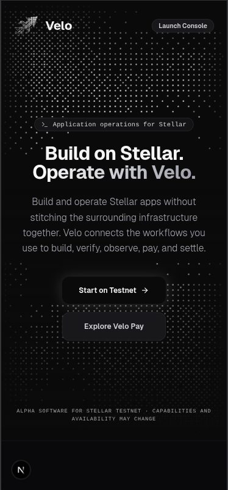</a>
      <br><strong>Landing page</strong>
    </td>
    <td align="center" width="33%">
      <a href="screenshots/mobile_dashboard.png">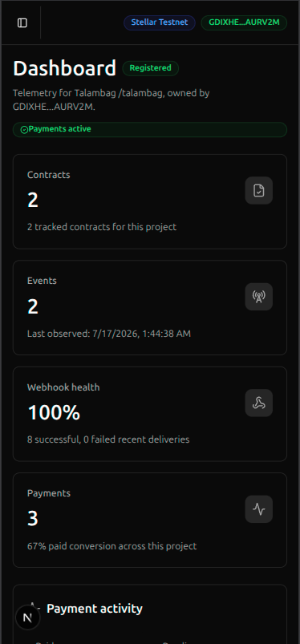</a>
      <br><strong>Project dashboard</strong>
    </td>
    <td align="center" width="33%">
      <a href="screenshots/mobile_apikeys.png">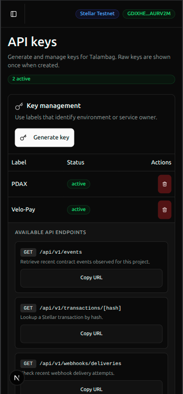</a>
      <br><strong>API keys</strong>
    </td>
  </tr>
</table>
</details>

<details>
<summary><strong>Verify and connect</strong></summary>
<br>
<table>
  <tr>
    <td align="center" width="33%">
      <a href="screenshots/mobile_public_proof.png">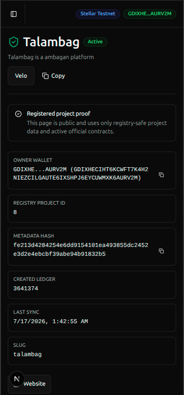</a>
      <br><strong>Public project proof</strong>
    </td>
    <td align="center" width="33%">
      <a href="screenshots/mobile_contracts.png">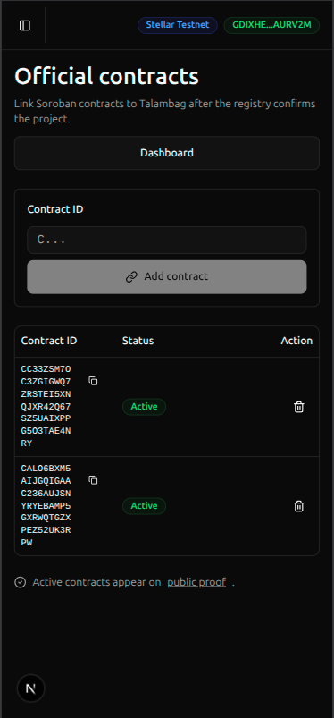</a>
      <br><strong>Official contracts</strong>
    </td>
    <td align="center" width="33%">
      <a href="screenshots/mobile_wallets.png">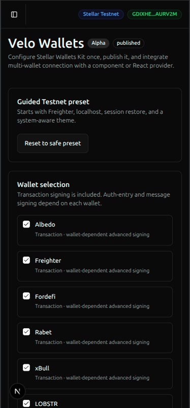</a>
      <br><strong>Wallet configuration</strong>
    </td>
  </tr>
</table>
</details>

<details>
<summary><strong>Observe and deliver</strong></summary>
<br>
<table>
  <tr>
    <td align="center" width="33%">
      <a href="screenshots/mobile_events.png">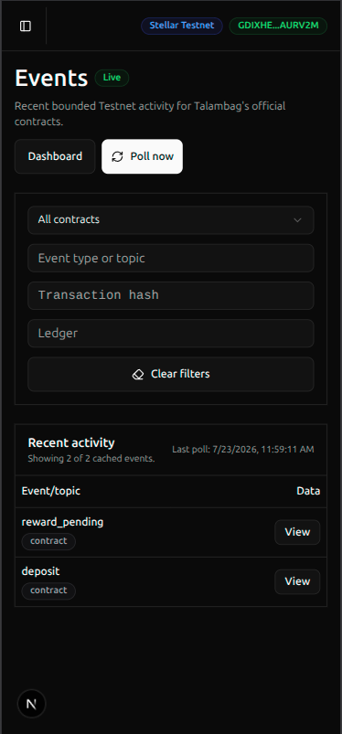</a>
      <br><strong>Contract events</strong>
    </td>
    <td align="center" width="33%">
      <a href="screenshots/mobile_debug.png">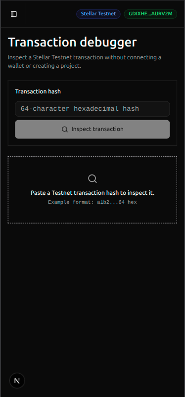</a>
      <br><strong>Transaction debugger</strong>
    </td>
    <td align="center" width="33%">
      <a href="screenshots/mobile_webhooks.png">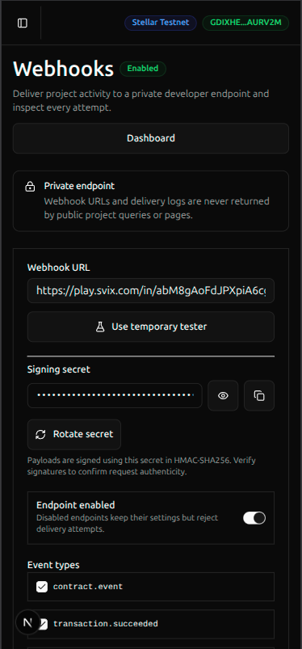</a>
      <br><strong>Webhook delivery</strong>
    </td>
  </tr>
</table>
</details>

<details>
<summary><strong>Integrate and settle</strong></summary>
<br>
<table>
  <tr>
    <td align="center" width="33%">
      <a href="screenshots/mobile_integration.png">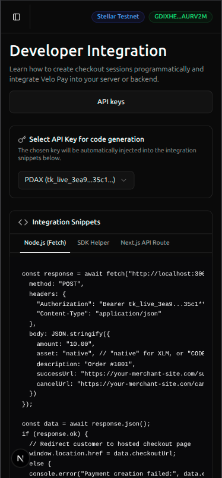</a>
      <br><strong>Developer integration</strong>
    </td>
    <td align="center" width="33%">
      <a href="screenshots/mobile_docs.png">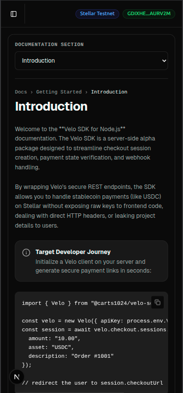</a>
      <br><strong>SDK documentation</strong>
    </td>
    <td align="center" width="33%">
      <a href="screenshots/mobile_settlement.png">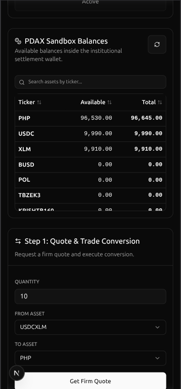</a>
      <br><strong>PDAX settlement</strong>
    </td>
  </tr>
</table>
</details>

## 🧩 Why Velo

Building a Stellar application is only the beginning. Teams still need to prove which contracts are official, inspect live behavior, accept payments, verify settlement against the ledger, notify merchant systems, and coordinate regional payout workflows.

Those jobs often end up fragmented across scripts, dashboards, providers, and manual runbooks. Velo brings them into one developer-first operating layer.

## 🔁 The Velo Operating Loop

**Build → Verify → Observe → Pay → Settle**

| Capability     | What Velo helps you do                                                                                      | Alpha status               |
| -------------- | ----------------------------------------------------------------------------------------------------------- | -------------------------- |
| 🛠️ **Build**   | Connect supported Stellar operations through APIs, SDKs, project workspaces, and reusable workflows.        | Implemented alpha          |
| ✅ **Verify**  | Link wallet authorization and on-chain provenance to the project and contracts an owner claims as official. | Live validation pending    |
| 📡 **Observe** | Inspect Testnet transactions, monitor contract events, and review signed webhook delivery.                  | Live qualification pending |
| 💳 **Pay**     | Create hosted Stellar checkout flows and return ledger-verified payment state to an application.            | Code-complete; E2E pending |
| 🏦 **Settle**  | Exercise supported stablecoin conversion and local payout workflows through PDAX UAT.                       | UAT demo only              |

Start with Velo Pay, then use the wider platform as your Stellar application grows.

## ✨ What You Can Do Today

- **Register verifiable projects** with wallet-owned identity and official contract references stored through `VeloRegistry`.
- **Activate payment access** through `VeloPayAccess`, which checks project state through the Registry contract.
- **Create PaymentIntents** through the Velo API or the server-side `@carts1024/velo-sdk`, with idempotency and anchor-aware routing.
- **Send customers to hosted checkout** where they connect a wallet and submit a Stellar Testnet payment.
- **Trust ledger evidence, not browser callbacks**: only the backend scanner can promote a payment to `paid` after verification.
- **Deliver signed webhooks** with HMAC-SHA256 signatures, retries, secret rotation, and delivery logs.
- **Debug transactions and monitor contracts** from the same project workspace.
- **Demonstrate regional settlement** with PDAX UAT balances, quotes, trades, InstaPay withdrawals, callbacks, and normalized merchant events.

## 🌐 How Velo Uses Stellar

Velo uses Stellar as the authorization, payment, and settlement-verification layer beneath its
Testnet operating loop.

| Stellar capability                  | How Velo uses it today                                                                                                                                                                                                            |
| ----------------------------------- | --------------------------------------------------------------------------------------------------------------------------------------------------------------------------------------------------------------------------------- |
| **Wallets and signatures**          | Stellar Wallets Kit connects supported wallets for authentication and transaction signing. Velo's current authentication flow uses a wallet-signed, SEP-10-style challenge; broader SEP-10 infrastructure remains on the roadmap. |
| **Classic transactions and assets** | `@stellar/stellar-sdk` and Horizon prepare and submit checkout transactions, inspect accounts and trustlines, and support native XLM and issued-asset payment flows.                                                              |
| **Stellar RPC and ledger data**     | Backend workers verify submitted transactions, reconcile pending payments, debug transaction results, and poll supported Soroban contract events.                                                                                 |
| **Soroban contracts**               | `VeloRegistry` records wallet-owned project identity and official contract references. `VeloPayAccess` reads Registry state to control payment activation and checkout credits.                                                   |
| **Ledger-verified payments**        | A browser submission never marks a PaymentIntent as paid. The backend checks the transaction against the intended source, destination, asset, and amount before updating state and scheduling `payment.succeeded`.                |
| **Stablecoin settlement**           | The current PDAX UAT workflow demonstrates how Stellar stablecoin collection can continue into quotes, trades, and Philippine local-payout flows. It is a sandbox integration, not production settlement.                         |

## 💡 Innovation and Differentiation

Velo composes Stellar primitives into application-ready workflows while keeping authorization and
payment truth verifiable on-chain. Its differentiation is the operating model around Stellar, not a
claim to replace wallets, Horizon, RPC providers, anchors, or the Stellar SDK.

- **One operating loop:** project provenance, payment access, hosted checkout, ledger verification,
  contract monitoring, signed webhooks, and settlement workflows share one project context.
- **Ledger evidence over client trust:** the checkout UI can submit a transaction, but only backend
  verification can finalize the payment.
- **Contracts plus operations:** Soroban authorization is connected to the API, SDK, checkout, event
  monitoring, and webhook surfaces that application teams need around a contract.
- **A progressive integration path:** teams can start with hosted Testnet checkout and adopt deeper
  infrastructure as their identity, payment, observability, and data requirements grow.
- **Explicit evidence boundaries:** implemented code, live-qualification work, roadmap commitments,
  and exploratory ideas are labeled separately.

## 👥 Who Velo Is For

- Stellar and Soroban teams that need an operational layer beyond contract deployment.
- Hackathon and early-stage builders who need a credible payment workflow quickly.
- Merchant platforms integrating stablecoin checkout and signed payment notifications.
- Operators validating transaction, webhook, contract, and settlement behavior.
- Ecosystem reviewers checking project ownership and official contract provenance.

## 📈 Go to Market

Velo's initial go-to-market is **B2B developer infrastructure for Stellar**. Its target customers are
fintechs, wallets, merchant platforms, anchors, and application teams that need payment and
operational capabilities without assembling every surrounding Stellar integration themselves.

1. **B2B design partners:** work with a small group of Testnet teams that have concrete checkout,
   verification, webhook, or settlement requirements. Track time to first successful payment,
   checkout completion, webhook delivery, and integration feedback.
2. **Technical pilots:** use the SDK, examples, documentation, and hosted flow to prove repeatable
   integrations and turn design-partner needs into reusable infrastructure.
3. **Ecosystem partnerships:** distribute those capabilities through direct developer outreach,
   hackathons, ecosystem programs, and integrations with wallets, anchors, payment providers, and
   Stellar applications.
4. **Production contracts:** introduce supported deployment paths, reliability targets, and
   usage-based or platform pricing only after the necessary security, compliance, partner,
   Mainnet-readiness, and operational work is complete.

The initial business model and the longer-term payment use case are distinct: Velo can serve
businesses as an infrastructure platform first, then expand into B2B payment workflows such as
supplier payments, enterprise payouts, and cross-border settlement as SEP-31, anchor connectivity,
and production settlement mature. The product wedge is verifiable checkout and payment operations;
the infrastructure expansion path includes shared SEP, account, transaction-sponsorship, RPC,
indexing, and developer-operations services.

## 🧭 How Velo Fits Together

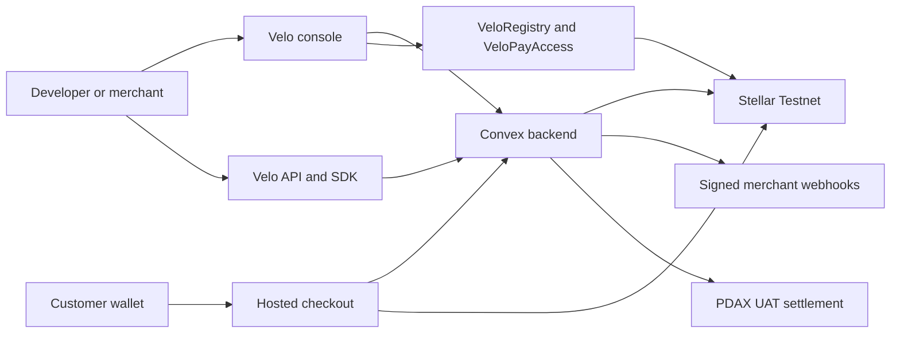

The browser can submit a payment, but it cannot declare success. Velo verifies the transaction from the backend before updating the PaymentIntent and dispatching `payment.succeeded`.

## 🔗 Current Testnet Contracts

| Contract        | Address                                                    | Explorer                                                                                                                            |
| --------------- | ---------------------------------------------------------- | ----------------------------------------------------------------------------------------------------------------------------------- |
| `VeloRegistry`  | `CBSR5LFHR5Q2X3PO3HSMGXI43YEUYGFTHUPGNVGW6XH2VNOQUEUHIEJR` | [View on Stellar Expert](https://stellar.expert/explorer/testnet/contract/CBSR5LFHR5Q2X3PO3HSMGXI43YEUYGFTHUPGNVGW6XH2VNOQUEUHIEJR) |
| `VeloPayAccess` | `CBHDLZYSYWETHPC6KDGH35S4SNBU5P7QWLNNDWYXJRHZMZDTQSKYVOXJ` | [View on Stellar Expert](https://stellar.expert/explorer/testnet/contract/CBHDLZYSYWETHPC6KDGH35S4SNBU5P7QWLNNDWYXJRHZMZDTQSKYVOXJ) |

These are alpha Testnet deployments and may be replaced as Velo evolves. After a redeployment,
update this table, the application environment, and the contract-specific READMEs together.

## 🛠️ Tech Stack

- **Web:** Next.js 16, React 19, TypeScript 5.9, App Router, Tailwind CSS.
- **Backend:** Convex queries, mutations, actions, crons, and wallet-challenge authentication.
- **Stellar:** Stellar Wallets Kit, `@stellar/stellar-sdk`, Horizon, Stellar RPC, and Testnet.
- **Smart contracts:** Rust, `soroban-sdk`, `VeloRegistry`, and `VeloPayAccess`.
- **Developer experience:** `@carts1024/velo-sdk`, REST APIs, signed webhooks, Express and Next.js examples.
- **Settlement:** Server-only PDAX UAT client for sandbox quotes, trades, withdrawals, and callbacks.
- **Tooling:** pnpm workspaces, Turborepo, oxlint, oxfmt, Husky, and GitHub Actions.

## 🚀 Run Velo Locally

### Prerequisites

- Node.js `>=18`.
- pnpm `10.25.0` or compatible.
- A Convex project.
- Rust and the Stellar CLI for smart-contract work.
- A funded Stellar Testnet wallet for live payment flows.

### 1. Install the workspace

From the repository root:

```bash
pnpm install
```

### 2. Configure the web environment

Create `apps/web/.env.local` with the core application values:

```bash
NEXT_PUBLIC_CONVEX_URL=<convex_deployment_url>
NEXT_PUBLIC_APP_URL=http://localhost:3000
NEXT_PUBLIC_STELLAR_NETWORK=testnet
NEXT_PUBLIC_STELLAR_RPC_URL=https://soroban-testnet.stellar.org
NEXT_PUBLIC_VELO_REGISTRY_CONTRACT_ID=CBSR5LFHR5Q2X3PO3HSMGXI43YEUYGFTHUPGNVGW6XH2VNOQUEUHIEJR
NEXT_PUBLIC_VELO_PAY_ACCESS_CONTRACT_ID=CBHDLZYSYWETHPC6KDGH35S4SNBU5P7QWLNNDWYXJRHZMZDTQSKYVOXJ
```

Authentication, backend, hosted deployment, and PDAX UAT flows require additional server-side configuration. See the [full environment reference](docs/velo-master-context.md#environment-variables) and [demo setup guide](docs/demo-setup.md).

### 3. Start the development workspace

```bash
pnpm dev
```

Open [http://localhost:3000](http://localhost:3000). To run only the web app:

```bash
pnpm --filter web dev
```

### 4. Try the merchant SDK

```ts
import { Velo } from "@carts1024/velo-sdk";

const velo = new Velo({
  apiKey: process.env.VELO_API_KEY!,
  environment: "testnet",
});

const session = await velo.checkout.sessions.create({
  amount: "10.00",
  asset: "native",
  description: "Velo Testnet checkout",
  successUrl: "http://localhost:3000/success",
  cancelUrl: "http://localhost:3000/cancel",
});

console.log(session.checkoutUrl);
```

Continue with the [Velo Pay checkout guide](docs/velo-pay-checkout.md), [Express example](examples/express/README.md), or [Next.js App Router example](examples/nextjs-app-router/README.md).

## 🧪 Test and Validate

Run the JavaScript and TypeScript quality gates from the repository root:

```bash
pnpm lint:fix
pnpm test
pnpm build
```

Run both Soroban contract suites:

```bash
cargo test --manifest-path contracts/registry/Cargo.toml
cargo test --manifest-path contracts/pay_access/Cargo.toml
```

Build the contract WASM artifacts:

```bash
stellar contract build --manifest-path contracts/registry/Cargo.toml
stellar contract build --manifest-path contracts/pay_access/Cargo.toml
```

## ⚡ Performance and Benchmarking

On July 15, 2026, Velo measured the hosted PaymentIntent-creation endpoint from `us-east-1`. The run
measured each HTTP request from its start until a valid payment-intent response was received from
`https://run-velo.vercel.app`.

| Observed metric           |        Result |
| ------------------------- | ------------: |
| Attempted requests        |         3,000 |
| Successful requests       |  3,000 (100%) |
| Errors / dropped requests |         0 / 0 |
| Successful throughput     | 10 requests/s |
| p50 latency               |      85.14 ms |
| p95 latency               |     108.11 ms |
| p99 latency               |     176.19 ms |
| Maximum latency           |     565.03 ms |

The workload used 10 warmup requests, 3,000 measured requests, a target rate of 10 requests per
second, concurrency of 25, and a 10-second request timeout. The capture ran on Node.js `v20.20.2` and
is recorded locally as
`benchmarks/reports/velo-us-east-1-2026-07-15T02-47-16-859Z.json` with its 3,000-sample raw NDJSON
artifact.


## 🚢 Deploy Smart Contracts

The deployment script releases both Velo contracts as an ordered, non-atomic sequence. It deploys
`VeloRegistry` first, deploys `VeloPayAccess`, initializes PayAccess with the Registry contract ID,
runs read-only smoke checks, and writes a deployment manifest. If a later step fails, earlier
successful uploads or deployments remain on the network and must be recorded before retrying.

> [!CAUTION]
> Velo remains Testnet alpha software. Mainnet support in the script provides guarded deployment
> mechanics; it does not mean the contracts have completed production security, audit, custody, or
> operational-readiness requirements.

### Prerequisites

Install the [Stellar CLI](https://developers.stellar.org/docs/tools/cli) and configure a funded CLI
identity for the target network. Pass the identity name to the script—never place a secret key or
seed phrase in the command.

For Testnet, create and fund an identity:

```bash
stellar keys add deployer
stellar keys fund deployer --network testnet
```

### Deploy to Testnet

Preview the contract test, build, deployment, initialization, and smoke-check commands without
executing them:

```bash
pnpm contracts:deploy --network testnet --dry-run
```

Deploy both contracts:

```bash
pnpm contracts:deploy --network testnet --source deployer
```

The deployment runs both Rust contract suites and builds optimized, locked WASM artifacts by
default. Use `--skip-tests` only if the same commit has already passed its contract tests. Use
`--skip-build` only when the expected optimized artifacts already exist.

### Deploy to Mainnet

Before deploying to Mainnet, complete the security and operational checklist in the
[contract deployment guide](contracts/README.md#mainnet). At minimum, verify the reviewed commit on
Testnet, review authorization and storage paths, establish deployer key custody and incident
procedures, and obtain independent peer review. High-value deployments also require an appropriate
audit or documented risk acceptance.

Preview the Mainnet plan:

```bash
pnpm contracts:deploy --network mainnet --dry-run
```

After completing the readiness checklist, deploy with the explicit Mainnet acknowledgement:

```bash
pnpm contracts:deploy \
  --network mainnet \
  --source production-deployer \
  --confirm-mainnet
```

The script locks the canonical passphrase for the selected network and refuses a live Mainnet
deployment without `--confirm-mainnet`.

### Record the deployment

A successful deployment writes `deployments/<network>.json`, containing the deployment time, Git
commit, deployer public key, contract IDs, and uploaded WASM hashes. The command also prints the
values to configure in the web and backend environments:

```bash
NEXT_PUBLIC_VELO_REGISTRY_CONTRACT_ID=<registry_contract_id>
NEXT_PUBLIC_VELO_PAY_ACCESS_CONTRACT_ID=<pay_access_contract_id>
VELO_PAY_ACCESS_CONTRACT_ID=<pay_access_contract_id>
```

See the [full contract deployment guide](contracts/README.md) for optional flags, safety checks, and
manifest details.

## 🗺️ Roadmap and Upcoming Features

Roadmap items describe current direction and may change as Velo learns from alpha users. They are not
claims of present availability.

### Payments, identity, and accounts

- SEP-10 authentication infrastructure.
- Smart-account infrastructure.
- SEP-24 deposit and withdrawal infrastructure.
- Gas-station infrastructure for sponsored transactions.

### Standards and developer tooling

- SDK support for SEP-6, SEP-10, SEP-24, SEP-31, SEP-38, and SEP-45.
- Broader developer-operations infrastructure.
- Smart-contract playground.

### Network and operations infrastructure

- Full Stellar RPC gateway.
- Distributed indexing layer.
- Production request logs and operational visibility.

### Exploring

- Deeper integration with Stellar Anchors.
- A reusable Stellar Anchor SDK, subject to findings from that exploration.

## 📦 Repository Map

```text
.
├── apps/web                 # Next.js application, console, checkout, and public pages
├── packages/backend         # Convex schema, functions, actions, crons, and tests
├── packages/observability   # Shared telemetry and redaction helpers
├── packages/pdax            # Server-only PDAX UAT client
├── packages/stellar         # Stellar transaction and contract helpers
├── packages/ui              # Shared React components and styles
├── packages/velo-sdk        # Public alpha server-side SDK
├── contracts/registry       # Soroban project registry contract
├── contracts/pay_access     # Soroban payment-access contract
├── examples                 # Express and Next.js merchant integrations
└── docs                     # Product, architecture, operations, and demo documentation
```

## 📚 Documentation

- [Velo master context](docs/velo-master-context.md) — product scope, trust boundaries, source map, and full environment reference.
- [Velo Pay checkout](docs/velo-pay-checkout.md) — PaymentIntent and hosted checkout lifecycle.
- [E2E demo guide](docs/demo-setup.md) — merchant onboarding, payment, webhook, and PDAX UAT walkthrough.
- [Velo SDK reference](packages/velo-sdk/README.md) — client setup, payment APIs, pagination, errors, and webhook verification.
- [Registry contract](contracts/registry/README.md) and [PayAccess contract](contracts/pay_access/README.md) — Soroban interfaces and tests.
- [Observability architecture](docs/architecture/sprint-10-end-to-end-observability-and-redaction.md) — correlation, telemetry export, and safe redaction.
- [Performance qualification architecture](docs/architecture/sprint-11-comparative-throughput-certification.md) — benchmark evidence and release gating.
- [PDAX settlement workflow](docs/prds/prd-velo-pdax/pdax-settlement-workflow.md) — UAT conversion and payout design.

## ⚠️ Alpha Boundaries

Before evaluating Velo, keep these constraints in view:

- Payment flows target Stellar Testnet.
- The Testnet contract IDs above still require explicit configuration and validation in each hosted environment.
- Checkout code is implemented, but the full wallet-to-webhook path still needs live rehearsal on target devices.
- PDAX support uses UAT credentials, sandbox balances, simulated pricing/liquidity, and demo payout flows.
- Mainnet settlement, production compliance workflows, and production custody are not implemented.
- Public API rate limiting still needs distributed production hardening.

## 🤝 Contributing

Keep changes focused, follow the existing package boundaries, and add tests beside the behavior you change. Before opening a pull request, run the relevant package tests plus `pnpm lint:fix` and `pnpm build`. Include screenshots for visible UI changes and link the relevant product or architecture document when applicable.

## 📄 License

MIT
