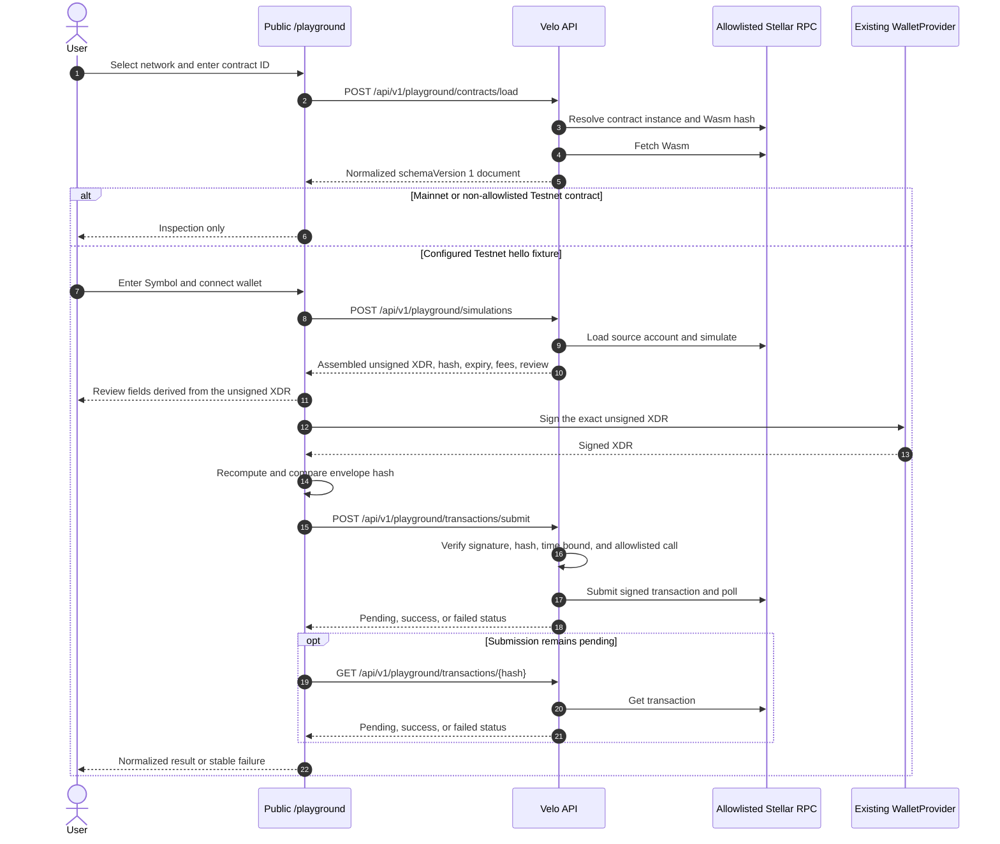

# Sprint 1 Playground contract-spec foundation

Status: **IMPLEMENTED — LIVE EVIDENCE PENDING**  
Applies to: Velo Playground Sprint 1  
Audience: maintainers, security reviewers, and API consumers  
Last reviewed: 2026-07-23

Sprint 1 implements contract-spec inspection for deployed Soroban contracts on
Testnet and Mainnet. It also implements one deliberately narrow invocation path:
the repository-owned Testnet `hello(Symbol) -> Vec<Symbol>` fixture. The checked-in
deployment manifest does not contain live contract IDs or Wasm hashes, so this
document does not claim a completed wallet or Testnet run.

The public contracts and type matrix are documented in the
[API and type reference](../references/sprint-1-playground-api-and-type-support.md).
Fixture deployment and qualification are documented in the
[operator runbook](../operations/sprint-1-playground-fixture-runbook.md).

## System boundary

## Locked decisions

### Package and schema ownership

The normalized model belongs in `@repo/stellar`; Sprint 1 does not introduce a
second spec package. `ContractSpecDocumentV1.schemaVersion` is the public
discriminator. The normalizer preserves every ordered source spec entry as its
index and base64 XDR, and computes `specHash` from length-prefixed ordered entry
bytes.

The loader resolves the contract instance before each load. Immutable normalized
spec data is cached by `network:wasmHash` for five minutes, with concurrent misses
deduplicated and a 100-entry least-recently-used bound. The response-specific
contract ID, latest ledger, load time, and correlation ID are refreshed on cache
hits. Wasm is limited to 1,048,576 bytes and a spec to 1,000 entries.

### Network and RPC policy

- Testnet and Mainnet support contract-spec loading and browsing.
- Mainnet invocation is disabled. The simulation endpoint rejects any network other
  than `testnet` before fixture or RPC work.
- The server chooses the RPC endpoint. Requests cannot supply an RPC URL or network
  passphrase.
- Configured RPC URLs must use HTTPS. Testnet uses
  `STELLAR_TESTNET_RPC_URL`, then `NEXT_PUBLIC_STELLAR_RPC_URL`, then the SDK
  Testnet default. Mainnet uses `STELLAR_MAINNET_RPC_URL`, then the configured
  Mainnet default in the loader.
- Instance and Wasm RPC operations have an eight-second timeout. HTTP 429 and 5xx
  failures are retried once; public failures are normalized and provider details are
  not returned.

### Invocation allowlist

Only the configured Testnet fixture may be invoked:

- `PLAYGROUND_HELLO_CONTRACT_ID` must be a valid contract StrKey.
- `PLAYGROUND_HELLO_WASM_HASH` must be 64 lowercase hexadecimal characters after
  normalization.
- The contract's current Testnet Wasm hash must still match configuration.
- The transaction must contain exactly one `invokeHostFunction` contract call.
- The call must target the configured contract and invoke `hello`.
- The sole argument must be a Soroban Symbol containing 1–32 ASCII letters,
  digits, or underscores.

All other loaded contracts are inspection-only in Sprint 1.

### Freshness and exact-envelope review

The server constructs a transaction with a 300-second timeout, simulates it, and
returns the SDK-assembled unsigned XDR. Network, source, contract, Wasm hash,
function, argument, sequence, time bounds, fee components, and transaction hash in
the review are parsed from that assembled transaction.

Changing network, contract ID, argument, or connected wallet address clears the
browser's prior simulation. Before submission:

1. the wallet signs the exact unsigned XDR;
2. the browser verifies that unsigned, signed, and reviewed hashes match;
3. the server independently verifies that the signed envelope hash matches the
   reviewed hash;
4. the server requires a valid source-account signature and rejects fee-bump,
   multi-operation, mismatched-call, expired, or over-long envelopes.

At verification time, `maxTime` must be in the future and no more than 330 seconds
ahead. Expired transactions require a new simulation and wallet signature.

### Submission and polling ownership

Velo's server submits the signed transaction. The browser does not receive a
provider-selected submission endpoint and does not submit directly to Stellar RPC.
The server verifies fixture drift immediately before submission, checks that the RPC
hash matches the reviewed transaction hash, and polls for up to 30 seconds at
one-second intervals. If still pending, the API returns HTTP 202. The browser then
polls the status endpoint up to 15 times at two-second intervals.

Stopping browser polling does not cancel the Stellar transaction. A client can query
the status endpoint again with the transaction hash.

### Wallet selection

The Playground reuses Velo's existing global `WalletProvider`, which is configured
for Testnet and delegates signing to Stellar Wallets Kit. The feature does not import
`@carts1024/velo-wallets`. That package requires a project-scoped setup that is not
appropriate for this anonymous public route.

Velo receives signed XDR from the wallet but never requests a seed phrase or private
key.

### Raw data and error disclosure

Successful spec responses include ordered source spec-entry XDR because source
preservation is part of `ContractSpecDocumentV1`. Simulation responses include the
unsigned transaction XDR because the wallet must sign it. These responses use
`Cache-Control: no-store`.

Public error envelopes include only `code`, `stage`, safe `message`, `retryable`,
and `correlationId`. Unexpected exceptions become `RPC_UPSTREAM`; exception causes,
provider URLs, signed XDR, signatures, and wallet secrets are not copied into the
public envelope. The submit endpoint does not echo signed XDR.

## Sprint 1 boundaries

Implemented:

- anonymous `/playground` contract loading and function inspection;
- normalized schema version 1, source XDR preservation, and deterministic fixture
  snapshots;
- Testnet/Mainnet inspection;
- one Testnet hello simulation, exact-XDR review, wallet signing, server submission,
  polling, and JSON-safe result path;
- stable public error envelopes and deterministic integrity tests.

Not implemented by Sprint 1:

- general-purpose form generation or invocation for arbitrary functions;
- Mainnet simulation or submission;
- user-selected/custom RPC endpoints;
- fee-bump, multisig, contract-account authorization, restore transactions, or
  arbitrary operation bundles;
- persisted transaction recovery after refresh, raw simulation diagnostics,
  generated code, saved requests, events in final results, or project integration;
- live fixture deployment and interactive wallet qualification.

## Source traceability

| Decision                                              | Source of truth                                                                           |
| ----------------------------------------------------- | ----------------------------------------------------------------------------------------- |
| Normalized schema and JSON-safe values                | `packages/stellar/src/contract-spec.ts`                                                   |
| Cache, limits, RPC selection, public errors           | `apps/web/features/playground/server/contract-loader.ts`                                  |
| Fixture allowlist                                     | `apps/web/features/playground/server/fixture.ts`                                          |
| Simulation, review, verification, submission, polling | `apps/web/features/playground/server/transaction-service.ts`                              |
| Browser hash verification                             | `apps/web/features/playground/client-integrity.ts`                                        |
| Wallet implementation                                 | `apps/web/core/wallet/wallet-provider.tsx`                                                |
| Public API routes                                     | `apps/web/app/api/v1/playground`                                                          |
| Deterministic qualification                           | `packages/stellar/src/contract-spec.test.ts` and `apps/web/features/playground/*.test.ts` |
