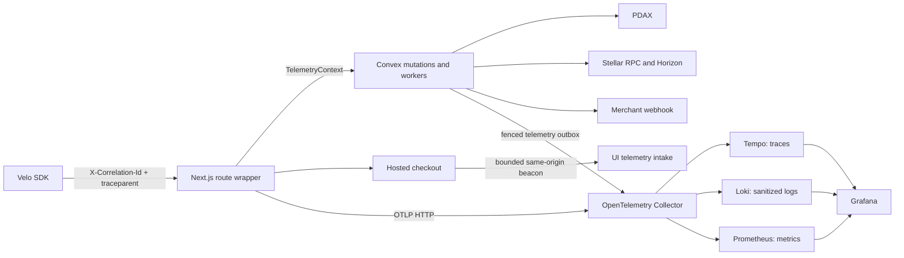

# Sprint 10: End-to-End Observability and Redaction

Status: **IMPLEMENTED — LIVE EVIDENCE PENDING**

Sprint 10 adds a vendor-neutral OTLP observability path across the Next.js API, Convex workers, PDAX, Stellar RPC/Horizon, merchant webhooks, the public SDK, and hosted-checkout UI. Deterministic tests validate the contracts and reconstruction logic. No checked-in artifact claims a live synthetic reconstruction or a `<3%` p95 overhead verdict.

## System boundary

The financial path is independent of export success. Web exports are best-effort, unawaited, and bounded by a one-second abort. Convex business mutations only enqueue telemetry; a separate action exports batches. Collector failures therefore cannot roll back a payment, settlement, or webhook transition.

## Shared telemetry contract

`@repo/observability` is runtime-neutral and exports `TelemetryContext`, catalog types, safe event types, W3C validation, deterministic sampling, OTLP identifier helpers, and metric-label validation.

`TelemetryContext` contains:

| Field                  | Contract                                                          |
| ---------------------- | ----------------------------------------------------------------- |
| `requestCorrelationId` | Required, 8–128 safe characters. Identifies the current request.  |
| `journeyCorrelationId` | Optional durable payment journey ID.                              |
| `traceparent`          | Optional validated W3C `00-<trace-id>-<parent-id>-<flags>` value. |

`linkedTraceparent` is a safe event field, not part of `TelemetryContext`. The route boundary uses it to export an idempotency replay link to the earlier payment trace.

Closed span names:

- `velo.http.server`
- `velo.convex.operation`
- `velo.worker.run`
- `velo.dependency.call`
- `velo.ui.render`

Closed stages:

- `auth`, `indexed_read`, `mutation`, `provider_auth`, `provider_call`, `submission`
- `ledger_wait`, `observation`, `state_update`, `queue_wait`, `webhook_network`, `ui_render`

Closed dependencies are `convex`, `pdax`, `stellar_rpc`, `horizon`, and `merchant`. Outcomes are `success`, `error`, `timeout`, `retry`, and `rejected`. Stable error codes are `invalid_input`, `unauthorized`, `not_found`, `rate_limited`, `dependency_unavailable`, `dependency_timeout`, `conflict`, `internal_error`, and `export_failed`.

Operations are bounded identifiers matching `[a-z0-9._:-]{1,96}`. Events are projected through an allowlist. Unknown keys, arbitrary exception strings, payloads, credentials, signatures, customer data, wallet data, and cyclic or nested hostile values are discarded.

## Correlation model

Every one of the 16 public/provider Next.js methods uses `withRouteTelemetry`.

- Every successful or handled-error response receives `X-Correlation-Id`.
- `X-Request-Id` remains a compatibility alias for that request ID.
- An accepted payment-intent response includes the durable `correlationId` and `X-Velo-Journey-Id`.
- An idempotency replay preserves the original payment journey ID, receives a new request correlation ID, and exports a trace link to the original payment trace.
- The SDK can send `RequestOptions.traceparent` without breaking existing callers.
- PDAX, Stellar RPC/Horizon, scheduled reconciliation, provider ingestion, webhook delivery, and checkout UI carry the available safe context.

The payment intent stores its durable `correlationId` and root `traceparent`. The ownership-checked `getProjectPaymentLifecycleByCorrelation` query first verifies the project owner, then reads project-and-correlation indexes. It returns payment intents, webhook deliveries, traceparents, an ordered stage list, and missing-stage diagnostics. Reads are bounded to 10 intents, 100 webhook deliveries, and 100 journey-stage rows.

Required lifecycle diagnostics are:

1. `payment_intent.created`
2. `payment_intent.submitted`
3. `payment_intent.observed`
4. `payment_intent.confirmed`
5. `webhook.acknowledged`
6. `ui.rendered`

Provider, worker, webhook, and UI additions use `journeyStages`, which expires after 14 days. This reconstruction is operational evidence only; it does not alter payment truth.

## UI measurements

The checkout emits enumerated markers: `checkout_start`, `checkout_ready`, `payment_submitted_rendered`, and `payment_verified_rendered`. `/api/telemetry/ui` enforces:

- same-origin requests when `Origin` is present;
- a 2,048-byte content-length limit;
- at most 120 requests per source bucket per minute, with at most 1,000 in-memory buckets;
- marker, duration, and payment-intent ID validation;
- an existing payment intent and matching durable correlation in Convex;
- a server-only `VELO_UI_TELEMETRY_INTAKE_SECRET` for the internal write.

UI duration is explicitly untrusted. It is useful for propagation latency and journey diagnosis, but never changes financial state.

## Convex outbox

Transaction-created spans and metrics enter `telemetryOutbox`. Success spans sample deterministically at 10% by journey or request ID; errors and non-success outcomes are retained. Metrics are unsampled.

The exporter:

- claims at most 100 due rows under a 60-second fenced lease;
- reclaims expired leases;
- sends traces to `/v1/traces` and metrics to `/v1/metrics`;
- deletes successfully exported rows immediately;
- retries failed exports at most five times with bounded exponential delay;
- exposes terminal rows as `dead_letter`;
- expires outbox and journey-stage rows after 14 days.

One-minute jobs export the outbox and capture bounded gauges. Hourly jobs expire telemetry and journey-stage rows. Gauge capture reads at most 101 rows per source and reports saturation rather than performing an unbounded scan.

## Metric catalog

Identifiers, customers, accounts, wallets, and correlations are forbidden metric labels. The only allowed label keys are `service`, `operation`, `stage`, `outcome`, `dependency`, `provider`, `queue`, `network`, and `status_class`.

| Area             | Metrics                                                                                                                                                                                                                         |
| ---------------- | ------------------------------------------------------------------------------------------------------------------------------------------------------------------------------------------------------------------------------- |
| Requests         | `velo_request_total`, `velo_success_total`, `velo_correlation_return_total`, `velo_error_total`, `velo_timeout_total`, `velo_retry_total`, `velo_rate_limit_total`, `velo_cache_hit_total`, `velo_idempotency_contention_total` |
| Queues/providers | `velo_queue_depth`, `velo_queue_oldest_seconds`, `velo_provider_event_backlog`, `velo_webhook_backlog`, `velo_cursor_lag_seconds`, `velo_scanner_backlog`, `velo_provider_healthy`                                              |
| Latency/UI       | `velo_webhook_lag_seconds`, `velo_confirmation_lag_seconds`, `velo_ui_propagation_seconds`, `velo_journey_duration_seconds`, `velo_journey_p95_seconds`                                                                         |
| Control          | `velo_telemetry_dead_letters`, `velo_locked_slo_p95_seconds`                                                                                                                                                                    |

Counters use monotonic delta OTLP sums, queue/health values use gauges, and duration observations use histograms with bounded buckets.

## Redaction and data boundaries

Operational business fields needed for settlement and reconciliation remain in their existing authorized tables. They are not copied into telemetry or logs.

New provider ingress writes typed `eventSummary` data and a `payloadDigest`; it does not persist a raw callback body. Provider operations gain typed `responseSummary` and stable `errorCode` fields. Telemetry emits only safe summaries and catalog values.

Deployment is intentionally widen–migrate–verify–narrow:

1. **Widened in code:** safe fields exist and legacy fields remain optional for dual reads.
2. **Migration implemented, deployment pending:** `normalizeLegacyDiagnostics` paginates both provider tables, removes legacy diagnostic values, and is idempotent.
3. **Verification implemented, deployment pending:** `verifyNoLegacyDiagnostics` scans both tables in bounded pages.
4. **Narrowing pending:** remove `rawEvent`, `resultJson`, and `errorMessage` only after a deployed verification reports zero forbidden rows.

The current code is therefore safe for new writes but does not claim that an external database has already been migrated or narrowed.

## Local observability stack

The checked-in Compose stack provisions OpenTelemetry Collector `0.128.0`, Prometheus `3.4.1`, Tempo `2.8.1`, Loki `3.5.1`, and Grafana `12.0.1`. Collector pipelines route traces to Tempo, logs to Loki, and metrics to the Prometheus exporter.

- Trace retention: 14 days (`336h`)
- Sanitized log retention: 14 days (`336h`)
- Metrics retention: 90 days
- Grafana dashboard UID: `velo-sprint-10`
- Grafana URL: `http://localhost:3001`
- Host OTLP/HTTP endpoint: `http://localhost:4318`

See the [operator runbook](../operations/sprint-10-observability-and-redaction-runbook.md) for startup, correlation lookup, alerts, migration, and recovery. See the [evidence report](../references/sprint-10-observability-redaction-and-overhead-report.md) for deterministic acceptance and pending live gates.
