# Sprint 11 Comparative Throughput Certification Architecture

Status: **IMPLEMENTED — LIVE EVIDENCE PENDING**

Sprint 11 adds a versioned qualification contract and a deterministic release gate on top of the
Sprint 9 benchmark lifecycle and Sprint 10 observability work. The repository proves contract
validation, digest handling, pairing, controller attestations, and verdict mathematics. It does
not contain an authorized staging deployment, funded wallets, raw captures, or approval signatures;
therefore no live capacity or comparative claim is made.

## Boundary and data flow

```mermaid
flowchart LR
  M[benchmarks/sprint11/manifest.json\nmanifest v4] --> F[freeze + SHA-256 digest]
  F --> R[benchmark-s11 runner]
  R --> C[external authorized controller]
  C --> W[matched baseline/candidate runs]
  W --> X[external raw JSON/NDJSON + digests]
  X --> G[sprint11 canonical gate]
  G --> V[machineVerdict]
  V --> A[Product + Architecture approvals]
  A --> D[tracked release decision]
```



The application, contract, infrastructure, wallet, confirmation, telemetry, workload, SLO,
authorization, and artifact-storage identities are represented in the manifest. Raw traces,
telemetry, wallet material, credentials, and large benchmark captures remain outside Git. The
tracked evidence directory contains only compact metadata and a truthful pending report.

## Versioned qualification contract

`benchmarks/sprint11/manifest.json` is manifest version **4** and requires evidence schema **3**.
It names three UTC windows (`morning`, `afternoon`, `evening`), seven headline journeys, cold and
warm temperatures, and the Sprint 11 arms: normal, growth, burst, soak, degraded-provider,
replay-idempotency, backlog-recovery, telemetry-on, telemetry-off, saturation-recovery, and
rollback. Normal and growth are paired across all three windows and temperatures. The checked-in
manifest intentionally leaves staging-only values such as revisions, infrastructure, confirmation
semantics, soak duration, capacity bounds, recovery deadline, and authorizations unresolved.

`validateSprint11Manifest` checks the version, exactly seven scenarios, three windows, UTC policy,
required arms, operating points, telemetry coverage, and headroom. Frozen validation additionally
requires resolved infrastructure and confirmation values, `status: "frozen"`, a 64-character
SHA-256 manifest digest, and `frozenAt`.

`freezeManifest` refuses a dirty Git status or an unresolved revision. It canonicalizes sorted object
keys before hashing, records `frozenRevision` and `frozenAt`, and writes the immutable digest.
`classifyManifestDrift` distinguishes candidate-capture invalidation (candidate/baseline/scenario/
profile/temperature/arm/confirmation changes) from a complete qualification reset
(infrastructure, window policy, workload, telemetry, SLO, schema, or artifact-storage changes).

## Evidence and gate model

Each report uses schema 3 and carries a cohort ID, baseline and candidate subjects, and run records.
`pairMatchedCohorts` matches by scenario, arm/profile, window, temperature, and rate, then requires
both baseline and candidate subjects. A normal or
growth cell without both subjects is pending; duplicate identities, digest mismatches, failed
latency/error/correlation/side-effect checks, or unresolved owners are failures. Missing latency,
correlation coverage, telemetry state, raw-artifact digest, reset proof, samples, or required Sprint
10/P0.1 evidence is explicitly pending. Missing evidence never implies a pass.

Capacity is derived from passing candidate steps only. The helper records a
`staircase+bounded-refinement` method, computes each required window, and uses the lowest sustainable
window result; the gate then requires the configured headroom (20% in the draft manifest) over normal
and growth operating points. A live operator must supply the approved soak duration, search
bounds/resolution, and recovery deadline before freezing; the draft contract leaves those values
unresolved rather than inventing qualification-friendly defaults.

The canonical evaluator in `scripts/sprint11-gate-lib.mjs` emits independent fields:

| Field | Meaning |
| --- | --- |
| `machineVerdict` | `PASS`, `FAIL`, or `EVIDENCE_PENDING` from deterministic checks |
| `approvalStatus` | `PENDING`, `APPROVED`, or `REJECTED` from approval records |
| `publicClaim` | Null unless both the machine verdict passes and approvals match the final evidence digest |

The optional competitor adapter is strict when supplied: it must include a named adapter,
authorization, equivalent confirmation definition, matched conditions, feature differences, and
uncertainty metadata. No adapter or named competitor is checked in.

## Controller and resume protocol

`scripts/sprint11-controller.mjs` models the external controller operations `reset`, `degrade`,
`recover`, `replay`, `backlog`, `telemetry`, `deployment`, and `rollback`. A controller is created
only with manifest, deployment, and infrastructure digests. Every attestation must echo all three
digests; each event receives a sequence, timestamp, payload digest, and phase. Checkpoints retain
the digests, event sequence, and phase.

`benchmark:s11:resume` calls `assertResumeDigests` and refuses a checkpoint when any manifest,
deployment, or infrastructure digest differs. Interrupted work is append-only; resumption is safe
only after those identities and the external deployment still match. The repository does not
implement the staging controller, browser/wallet driving, provider degradation, or rollback itself.

## Compatibility and release boundary

The Sprint 11 commands are registered in the root package:

```text
benchmark:s11:plan       benchmark:s11:run       benchmark:s11:resume
benchmark:s11:merge      benchmark:s11:regression benchmark:s11:gate
benchmark:s11:report     benchmark:s11:self-test benchmark:s11:test
```

`benchmark:s11:gate` is the only Sprint 11 release evaluator and requires Product and Architecture
approvals when invoked. Older Sprint 9 evidence is not upgraded by this implementation. The legacy
release-gate tests remain compatibility coverage for earlier contracts; Sprint 11 evidence must
carry manifest version 4 and schema 3.

See the [operator runbook](../operations/sprint-11-comparative-throughput-qualification-runbook.md)
for the authorized capture workflow and the [qualification report](../references/sprint-11-comparative-throughput-qualification-report.md)
for the current evidence disposition.
