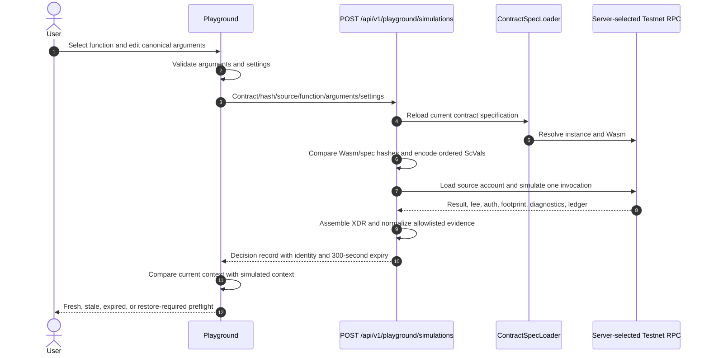

# Sprint 3 Playground simulation and preflight

Status: **IMPLEMENTED AND TESTED — LIVE FIXTURE EVIDENCE PENDING**  
Applies to: Velo Playground Sprint 3 (PG-301–PG-304)  
Audience: frontend developers, API consumers, maintainers, and security reviewers  
Last reviewed: 2026-07-23

Sprint 3 makes simulation the decision point between Sprint 2's canonical argument
editor and the Sprint 4 transaction lifecycle. Any supported Testnet function can
be simulated. This document records the Sprint 3 boundary; Sprint 4 subsequently
adds Mainnet simulation, generalized exact-XDR review, Testnet signing/submission,
pending recovery, and terminal event evidence. See the
[Sprint 4 architecture](sprint-4-playground-wallet-review-lifecycle.md) and
[API/lifecycle reference](../references/sprint-4-playground-api-and-lifecycle.md)
for the current contracts.

## Request flow and trust boundary



The server selects the HTTPS RPC endpoint. Requests cannot provide an RPC URL or
network passphrase. RPC calls use the existing eight-second timeout and one bounded
retry for HTTP 429 and upstream 5xx responses. Sprint 4 extends this server-selected
simulation path to Mainnet while retaining simulation-only Mainnet behavior.

## Public simulation request

`POST /api/v1/playground/simulations`

```ts
type PlaygroundSimulationRequest = {
  network: "testnet" | "mainnet";
  contractId: string;
  expectedWasmHash: string;
  expectedSpecHash: string;
  sourceAccount: string;
  functionName: string;
  arguments: Record<string, CanonicalArgumentValue>;
  settings?: {
    baseFee?: string;
    cpuInstructions?: number;
  };
};
```

`arguments` uses the parameter-keyed canonical shapes defined by the
[Sprint 2 argument system](sprint-2-playground-dynamic-argument-system.md). The
server resolves the selected function from the freshly loaded specification and
calls `encodeFunctionArguments`, which emits `ScVal` values in specification order.

The base fee defaults to `100` stroops and is bounded from `100` through
`10,000,000`. Additional CPU instructions default to zero and are bounded through
`100,000,000`. Both settings participate in freshness.

The Sprint 1 body remains accepted only for the configured hello fixture:

```ts
type DeprecatedHelloSimulationRequest = {
  network: "testnet";
  contractId: string;
  sourceAccount: string;
  argument: string;
};
```

It is normalized to `functionName: "hello"`, `{ to: argument }`, the configured
fixture Wasm hash, and default settings. New consumers must use the generalized
body.

## Decision record

A successful request returns HTTP 200 and `Cache-Control: no-store`.
`status` is `success` or `restore_required`.

| Group | Returned facts |
| --- | --- |
| Identity | simulation/correlation IDs, SHA-256 identity, local context key |
| Freshness | simulated time, 300-second expiry, latest RPC ledger |
| Request | network, contract and hashes, source, function, argument names, settings |
| Envelope | unsigned XDR and exact transaction hash |
| Result | typed decoded value when possible and raw `ScVal` XDR |
| Fees | base, minimum resource, total, one-XLM warning threshold |
| Authorization | required flag, credential kind, raw entry XDR |
| Footprint | separately listed read-only and read-write ledger keys |
| Evidence | RPC ID, transaction data, diagnostics, state changes, restore preamble |

If normalized output decoding fails, the service attempts the SDK's JSON-safe native
decoder, retains the raw return XDR, and emits `DECODE_FALLBACK`. It never makes a
decode failure look like a different typed value.

A restore preamble produces `restore_required`, retains the evidence for inspection,
and is never signable. Sprint 3 does not construct restore transactions.

## Warnings and explanations

| Code | Source | Meaning |
| --- | --- | --- |
| `ARCHIVED_STATE` | RPC | A restore preamble is present |
| `AUTHORIZATION_REQUIRED` | RPC | Soroban authorization entries are present |
| `INSUFFICIENT_FEE_BALANCE` | Velo inference | Account balance is below the assembled fee |
| `EXCESSIVE_FEE` | Velo inference | Total fee exceeds 10,000,000 stroops |
| `NO_WRITES` | RPC | “No writes detected in this simulation.” |
| `DECODE_FALLBACK` | Velo inference | Typed output decoding was incomplete |
| `MAINNET_SIMULATION_ONLY` | Velo inference | Mainnet cannot proceed to signing/submission |
| `EXECUTION_NOT_GUARANTEED` | Velo inference | Simulation cannot guarantee final execution |

The UI labels RPC facts separately from Velo inferences. Missing accounts and
contract changes are blocking errors rather than advisory warnings.

## Freshness and signing

The server hashes a stable canonical representation of network, contract ID, Wasm
hash, spec hash, source account, function, canonical arguments, base fee, and CPU
leeway. The browser computes the same stable context representation for comparison.

- Canonically equivalent object-key formatting does not invalidate a result.
- Any identity input change makes the retained result stale.
- A result expires after 300 seconds.
- Restore-required results are never fresh.
- An aborted or superseded request cannot replace a newer browser result.
- Sprint 4 permits any fresh, successful, Testnet `signingEligible` response to enter
  exact-XDR review and signing after explicit fingerprint confirmation.

Automatic restore remains deferred. Generalized Testnet signing, Mainnet simulation,
and minimal pending recovery are implemented by Sprint 4.

## Diagnostics and disclosure

Evidence is projected field-by-field; SDK response and exception objects are never
serialized. Public errors may contain the safe correlation ID, stage, and an
allowlisted diagnostic-event bundle. Provider URLs, HTTP headers, environment
values, stacks, signed envelopes, signatures, private keys, and wallet secrets are
excluded.

Copied bundles contain only the normalized response. Canonical argument values are
not echoed. Exact secret-seed strings and configured secret-looking object keys are
replaced with `[REDACTED]`. Raw unsigned transaction and protocol XDR remain
available because they are required for technical reproduction and, for the hello
fixture, wallet signing.

## Verification

Verified locally:

- `pnpm --filter web lint:fix`
- `pnpm --filter @repo/stellar lint:fix`
- `pnpm --filter web test` — 122 tests passed
- focused Playground tests — 6 test files passed
- `pnpm --filter web build`
- `cargo test` in `contracts/playground-fixtures` — 11 integration tests passed

The full `@repo/stellar` suite retains the pre-existing opaque
`transaction-debugger.test.ts` process failure; all other Stellar test files,
including the Sprint 2 argument suite, pass. No Sprint 3 code changes that test.

Live generalized simulations for every deployed fixture remain pending because no
funded Testnet source account was configured during this implementation run.

Source of truth:

- simulation service and evidence mapping:
  `apps/web/features/playground/server/transaction-service.ts`;
- freshness and canonical context comparison:
  `apps/web/features/playground/simulation-state.ts`;
- browser preflight:
  `apps/web/features/playground/playground-client.tsx`;
- API route: `apps/web/app/api/v1/playground/simulations/route.ts`.
