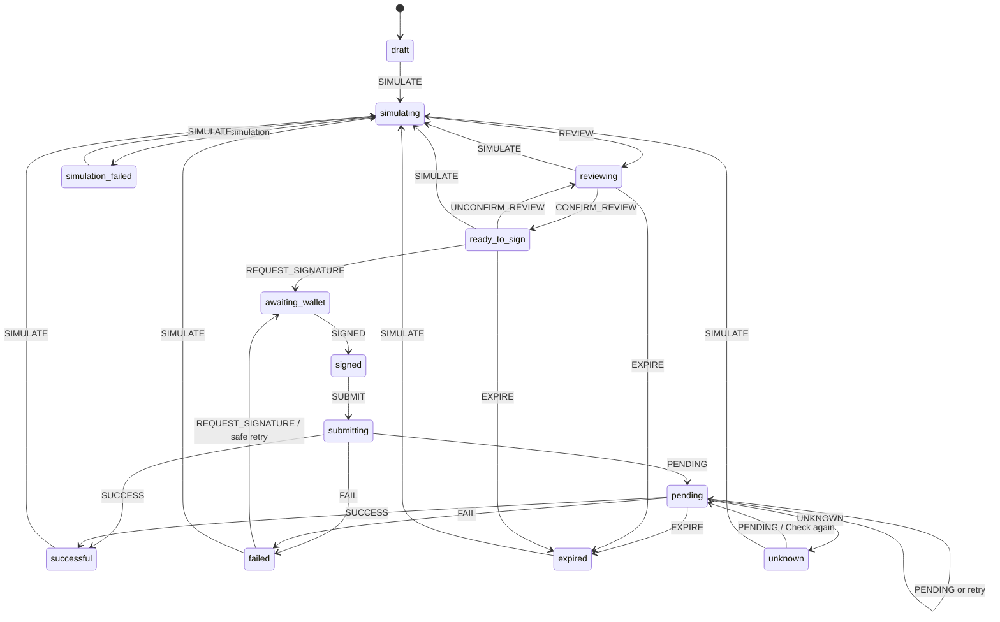

# Sprint 4 Playground wallet, review, lifecycle, and results

Status: **IMPLEMENTED AND TESTED — LIVE WALLET/NETWORK EVIDENCE PENDING**

Applies to: Velo Playground Sprint 4 (PG-401–PG-405)

Audience: frontend developers, API maintainers, security reviewers, and operators

Last reviewed: 2026-07-23

Sprint 4 completes the anonymous Playground transaction path for supported Testnet
contract calls. A user can simulate, inspect the exact assembled envelope, explicitly
confirm that review, sign with the existing global wallet provider, submit through
Velo's API, recover a pending transaction after refresh, and inspect decoded and raw
terminal evidence. Mainnet supports contract loading and simulation only; signing
and submission remain disabled in both browser and server paths.

## Trust boundaries and ownership

- The browser owns canonical argument editing, review confirmation, wallet
  interaction, lifecycle presentation, and minimal pending recovery state.
- The existing global `WalletProvider` and Stellar Wallets Kit own wallet discovery,
  connection, Testnet signing, and disconnect. The anonymous Playground does not use
  the project-scoped `@carts1024/velo-wallets` runtime.
- Velo's server reloads the current contract, constructs and simulates the unsigned
  transaction against a server-selected RPC, derives the review from assembled XDR,
  verifies the signed envelope, and owns the server-selected RPC submission call.
- Stellar RPC is authoritative for simulation evidence and terminal transaction
  status. Stopping browser polling does not cancel a transaction.
- The browser initiates submission through Velo's API. It does not submit directly
  to an arbitrary or user-selected RPC endpoint.

```mermaid
sequenceDiagram
    autonumber
    actor User
    participant Browser as Anonymous Playground
    participant Wallet as Wallet via Stellar Wallets Kit
    participant API as Velo Playground API
    participant RPC as Server-selected Stellar RPC

    User->>Browser: Choose network, contract, function, and arguments
    User->>Browser: Acknowledge Mainnet if selected
    Browser->>API: POST /simulations with context and settings
    API->>RPC: Reload contract/source and simulate one invocation
    RPC-->>API: Simulation, fees, auth, footprint, and diagnostics
    API->>API: Assemble XDR and derive exact review/fingerprint
    API-->>Browser: Decision record, review, unsigned XDR
    Browser-->>User: Show review and require explicit confirmation
    alt Testnet and fresh/signing eligible
        User->>Browser: Confirm review and request signing
        Browser->>Wallet: Sign exact unsigned XDR on Testnet
        Wallet-->>Browser: Signed XDR
        Browser->>Browser: Compare unsigned, signed, and reviewed hashes
        Browser->>Browser: Persist minimal pending identity
        Browser->>API: POST /transactions/submit
        API->>API: Verify network, signature, hash, call, expiry, and current Wasm
        API->>RPC: Send verified transaction
        RPC-->>API: Submission status/hash
        API->>RPC: Poll by transaction hash
        API-->>Browser: Pending, success, or failure
        Browser->>API: GET /transactions/{hash} when pending or recovering
        API->>RPC: Query Testnet transaction
        RPC-->>API: Pending or terminal evidence
        API-->>Browser: Normalized result/events/raw evidence
    else Mainnet
        Browser-->>User: Simulation-only; signing disabled
    end
```

The signed XDR crosses the browser-to-server boundary only in the submit request.
The server does not echo it, and the browser does not persist it.

## Network-aware simulation and review integrity

The generalized simulation request accepts `testnet` or `mainnet`. The server
selects the matching network passphrase and RPC, reloads the contract specification,
rejects Wasm/spec drift, encodes the selected function's arguments, simulates one
contract invocation, and assembles the exact unsigned envelope.

The returned review is derived from that assembled XDR. It includes network, source
account, contract and current Wasm hash, function, decoded arguments, sequence and
bounded time bounds, base/resource/total fee, authorization entries, predicted
writes, unsigned XDR, and transaction hash. The transaction hash is the exact
envelope fingerprint.

The browser permits signing only when all of these remain true:

- the current network, contract/hashes, wallet source, function, canonical arguments,
  base fee, and CPU leeway still match the simulation context;
- the simulation is fresh, successful, and not restore-required;
- `review.transactionHash`, the top-level transaction hash, and hashes derived from
  the unsigned and wallet-signed XDR agree;
- `review.unsignedXdr` equals the top-level unsigned XDR;
- the user explicitly confirmed the current fingerprint; and
- the network is Testnet and `signingEligible` is true.

Changing any bound context resets review confirmation. Expiry also removes signing
eligibility. A new simulation is required before a changed envelope can be signed.

## Wallet states and errors

The Playground displays the wallet status, current or stale account, selected wallet
name, typed error code, and disconnect/reconnect control. The global provider
retains its existing statuses: `initializing`, `ready`, `connecting`, `connected`,
`disconnected`, `rejected`, `unavailable`, `unsupported`, `stale`, and `error`.

The provider signs only with the Testnet passphrase. It classifies missing
connection, unavailable runtime, rejected requests, unsupported capabilities, stale
sessions, network mismatch, and signing failure through the codes documented in the
[Sprint 4 API and lifecycle reference](../references/sprint-4-playground-api-and-lifecycle.md).
Wallet account or network context changes invalidate the current simulation and
review.

## Lifecycle and refresh recovery

The transaction lifecycle is a pure reducer. Unsupported or duplicate transitions
return the current state, preventing repeated signature and submission transitions.



Before the submit request, the browser writes only this record to
`sessionStorage` under `velo:playground:pending:v1`:

```ts
type PendingTransactionIdentity = {
  schemaVersion: 1;
  network: "testnet";
  transactionHash: string;
  startedAt: string;
};
```

On mount, malformed records are removed. A valid record starts lookup by hash
without signing or resubmitting. Recovery and normal client polling each use a
shared bounded helper: 15 attempts by default, two seconds apart, with transient
lookup failures treated as unresolved attempts. A terminal result clears the record.
If polling ends without a terminal result, the client enters `unknown`, retains the
hash, and offers **Check again**. Unknown is a client state; the status API itself
continues returning `pending` while RPC reports `NOT_FOUND`.

## Submission verification and final evidence

Generic submission is Testnet-only and accepts a non-fee-bump transaction with
exactly one `invokeContract` operation. Before the server submits it, verification
requires:

- a 64-character reviewed transaction hash matching the envelope hash;
- at least one valid source-account signature;
- a bounded, current time range within the simulation freshness allowance;
- a call matching the freshly loaded contract specification; and
- an unchanged current Wasm hash matching `expectedWasmHash`.

When `expectedWasmHash` is omitted, the deprecated hello compatibility path remains:
the configured fixture, call, argument, hash, signature, expiry, and current fixture
Wasm are verified.

A successful status response includes the decoded and raw return value, charged fee,
final ledger, transaction hash, Stellar Expert Testnet URL, decoded contract events,
each event's raw XDR, and raw result/result-meta/diagnostic-event XDR. Decode failure
falls back to `null` while preserving raw evidence. An execution failure includes
its ledger and raw result, result-meta, and diagnostic-event XDR.

## Failure disclosure, privacy, and Mainnet policy

The client lifecycle distinguishes `form`, `building`, `simulation`, `review`,
`signing`, `submission`, `execution`, `expiry`, and `timeout` failure stages.
Public API errors provide a safe code, stage, message, retryability flag, and
correlation ID. Simulation diagnostics are projected and redacted rather than
serializing provider exceptions.

Secret-looking keys, Stellar secret seeds, provider URLs, headers, environment
values, stacks, private keys, signatures, and wallet secrets are excluded or
redacted from public evidence. Anonymous transaction recovery never stores signed
XDR, results, events, arguments, or wallet secrets.

Mainnet simulation requires an explicit browser acknowledgement, returns
`signingEligible: false`, includes the `MAINNET_SIMULATION_ONLY` warning and
safeguard message, and visibly identifies Mainnet. The client does not expose the
sign action for Mainnet. The submit API independently rejects every non-Testnet
request with `MAINNET_INVOCATION_DISABLED`.

## Verification

Verified in this worktree on 2026-07-23:

- `pnpm --filter web test` — 138 of 138 tests passed;
- `pnpm --filter web lint:fix` — Oxlint, Oxfmt, route type generation, and TypeScript
  checks passed with no warnings;
- `pnpm --filter web build` — production build passed;
- focused `@repo/stellar` contract-argument and contract-spec test files passed;
- `cargo test` in `contracts/playground-fixtures` — 11 integration tests passed; and
- `git diff --check` — passed.

The full `@repo/stellar` command retains the pre-existing isolated
`transaction-debugger.test.ts` process failure documented at the Sprint 3 boundary;
the other seven Stellar test files passed.

No live Freighter connection/signature, Testnet submission/recovery, or Mainnet
simulation run was performed during this implementation. Those live qualification
gates remain pending.

Source of truth:

- wallet state and signing: `apps/web/core/wallet/wallet-provider.tsx`;
- browser lifecycle and recovery:
  `apps/web/features/playground/playground-client.tsx`;
- pure reducer and persisted record:
  `apps/web/features/playground/transaction-lifecycle.ts`; and
- simulation, review, verification, submission, and result decoding:
  `apps/web/features/playground/server/transaction-service.ts`.
