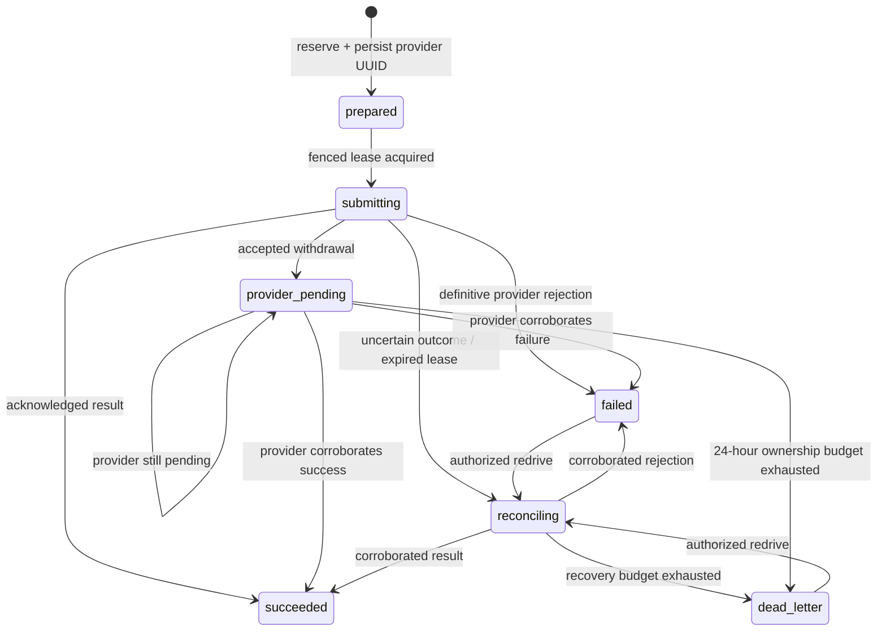

# Sprint 8 Durable Financial Reliability

## Purpose and evidence boundary

Sprint 8 moves financial side effects behind durable database ownership. The system targets
**exactly-once observable transitions**: retries and competing workers converge on one recorded
operation or delivery. It does not claim exactly-once transport to PDAX, Stellar RPC, or merchant
endpoints.

This document describes code behavior and deterministic automated evidence. Sprint 8 provides no
live SLO qualification and no production availability evidence.

## Financial operation model

`providerOperations` is the durable authority for PDAX trade and fiat-withdrawal attempts. Its
logical identity is `(projectId, provider, operation, clientKey)`. The row stores a canonical
SHA-256 request fingerprint and a server-generated PDAX UUID before provider dispatch. A replay
with the same fingerprint observes the existing row; a changed request fails as a conflict. This
is covered for both operation types by [`100 concurrent %s reservations produce one operation and one submission claim`](../../packages/backend/convex/tests/durableReliability.test.ts).

Every completion checks the expected state, lease token, and generation. Stale completions are
ignored, as demonstrated by [`lease fencing rejects stale completion and ambiguous trades cannot resubmit`](../../packages/backend/convex/tests/durableReliability.test.ts).

PDAX withdrawals reconcile by the persisted provider UUID. Work is claimed in pages of at most 100
and processed with concurrency 10. Ambiguous trades are never resubmitted because PDAX exposes no
safe lookup by the trade idempotency UUID; they remain reconciliation/operator-recovery work. The
no-resubmission invariant is covered by [`lease fencing rejects stale completion and ambiguous trades cannot resubmit`](../../packages/backend/convex/tests/durableReliability.test.ts).

## Payment and event reliability

Pending Stellar payments receive `paymentReconciliationJobs`. RPC `not_found`, missing hashes, and
transport errors enqueue or retain reconciliation instead of immediately failing the payment. Jobs
use leases, generations, bounded retries, and visible dead letters. The page-size capacity contract
is covered by [`10,000 reconciliation jobs drain in exactly 100 bounded pages`](../../packages/backend/convex/tests/durableReliability.test.ts); fast confirmation remains covered by [`watchTransaction handles fast confirmation successfully`](../../packages/backend/convex/tests/paymentIntentFastPath.test.ts).

PDAX callbacks enter Convex directly at `POST /api/webhooks/pdax/v1?token=…`. The ingress requires
the configured token, `application/json`, a body no larger than 64 KiB, and the strict shared PDAX
normalizer. Valid unmatched events are quarantined; matched unsigned callbacks remain hints until a
provider lookup corroborates a terminal result. Parser allowlisting and rejection behavior are
covered by [`normalizes an allowlisted crypto webhook`](../../packages/pdax/src/client.test.ts),
[`normalizes an allowlisted fiat webhook`](../../packages/pdax/src/client.test.ts), and
[`rejects malformed and stale webhook shapes`](../../packages/pdax/src/client.test.ts).

## Outbound webhooks and distributed limits

Each merchant event has an immutable `webhookDomainEvents` identity. A delivery is unique by
`(event, endpoint, schemaVersion)`, and attempts are fenced by lease token and generation. The
deduplication and stale-worker behavior is covered by [`duplicate delivery triggers share one fenced delivery`](../../packages/backend/convex/tests/durableReliability.test.ts); retry/dead-letter behavior is covered by [`webhook delivery retry and backoff lifecycle`](../../packages/backend/convex/tests/webhookDelivery.test.ts) and [`webhook retry scheduling honors Retry-After for retryable endpoint failures`](../../packages/backend/convex/tests/webhookDelivery.test.ts).

Outbound envelopes carry `version: "1"`. The SDK treats an omitted legacy version as v1, verifies
the HMAC before reporting an unsupported explicit version, and validates settlement/provider event
shapes. Evidence: [`verifyWebhookSignature normalizes a signed legacy event to version 1`](../../packages/velo-sdk/src/webhooks.test.ts), [`verifyWebhookSignature accepts settlement and provider event payloads`](../../packages/velo-sdk/src/webhooks.test.ts), and [`verifyWebhookSignature verifies HMAC before rejecting unsupported versions`](../../packages/velo-sdk/src/webhooks.test.ts).

Payment REST routes consume transactional token buckets before their backend operation: API-key
capacity 200/refill 60 per second and project capacity 300/refill 100 per second. Shared enforcement
is covered by [`distributed rate limits are shared by concurrent callers`](../../packages/backend/convex/tests/durableReliability.test.ts).

## Public interfaces

- Settlement actions keep their arguments except `registerWebhook`, which now accepts only
  `projectId`. Trade/withdraw responses expose `succeeded`, `in_progress`, or `recovery_required`
  with an `operationId`.
- `provider_operations.queries.get` and `listRecovery` expose owned operation status.
- `provider_operations.mutations.redrive` authorizes recovery without changing the fingerprint or
  provider UUID.
- `rate_limits.mutations.consume` is the transactional gate used by public REST routes.
