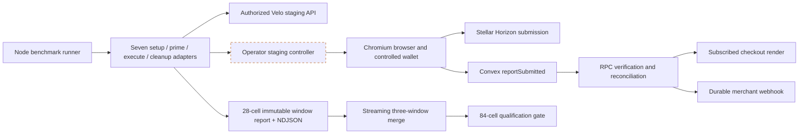
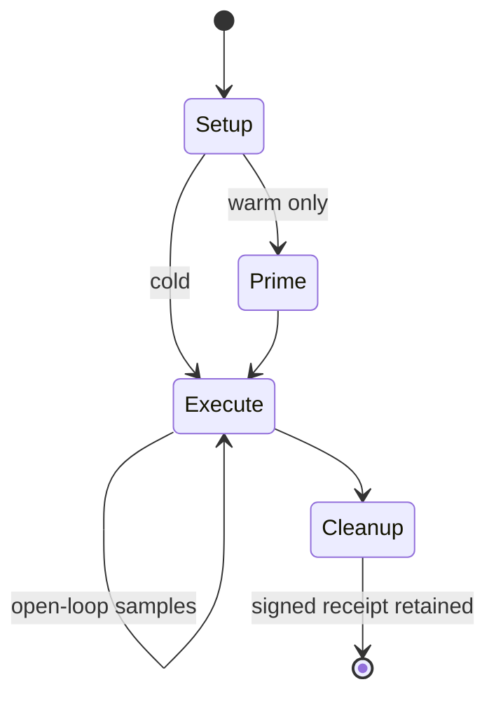
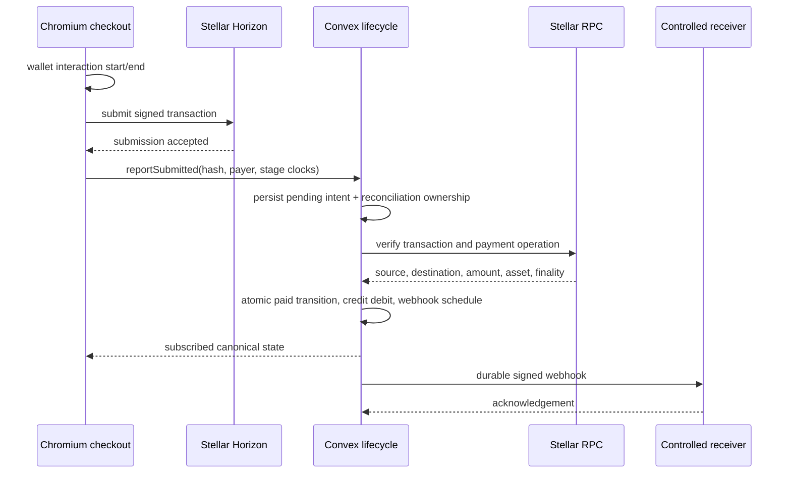
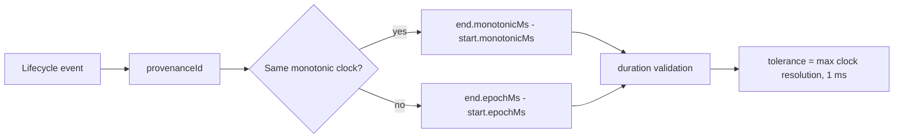
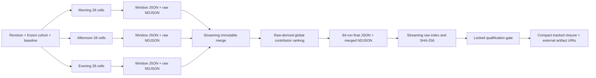

# Sprint 9 Real-Lifecycle Benchmark Architecture

## Status and scope

**CAPTURE PENDING — AUTHORIZED STAGING RESOURCES/WINDOWS REQUIRED.** Sprint 9 implements the
repository-side runner, seven client adapter contracts, lifecycle validation, immutable
three-window merge, raw-evidence indexing, and the 84-cell qualification gate. It does **not** ship
the operator staging controller that those adapters call. No live Sprint 9 evidence or P0.1 pass is
recorded.

This design succeeds the benchmark portions of the
[Sprint 8 architecture](./sprint-8-durable-financial-reliability.md) without replacing Sprint 8's
durability model. The operator procedure is the
[Sprint 9 runbook](../operations/sprint-9-real-lifecycle-benchmark-runbook.md); evidence disposition
is in the [Sprint 9 closure record](../references/sprint-9-benchmark-evidence-and-closure.md).

## Implemented boundary



The repository contains the solid-line application and evidence code. The dashed controller is an
external prerequisite. It must implement all seven scenario paths, provision cohort-scoped data,
drive Chromium and the controlled wallet where needed, return lifecycle evidence, attest cold
resets, and prove cleanup. The HMAC client contract is implemented; controller handlers are not.

## Qualification matrix

The current contract is version 3 with evidence schema version 2. Qualification is the Cartesian
product below:

| Axis        | Values                            |        Count |
| ----------- | --------------------------------- | -----------: |
| Scenario    | Seven headline journeys           |            7 |
| Profile     | `normal`, `growth`                |            2 |
| Temperature | `cold`, `warm`                    |            2 |
| UTC window  | `morning`, `afternoon`, `evening` |            3 |
| **Total**   | `7 × 2 × 2 × 3`                   | **84 cells** |

Each window capture contains exactly 28 cells. `morning` is 00:00–07:59 UTC, `afternoon` is
08:00–15:59 UTC, and `evening` is 16:00–23:59 UTC. Both `startedAt` and `completedAt` must fall
inside the named window. Successive windows must be chronologically separated by at least 60
minutes.

### Scenario registry

| Scenario                 | Adapter                                | Controller base path      | Required lifecycle events                                                 | Primary metric              |
| ------------------------ | -------------------------------------- | ------------------------- | ------------------------------------------------------------------------- | --------------------------- |
| `payment-intent-create`  | HTTP plus controlled fixture lifecycle | `/payment-intent-create`  | `http.request_start`, `http.response_end`                                 | `http_request_ms`           |
| `payment-intent-list`    | HTTP plus controlled fixture lifecycle | `/payment-intent-list`    | `http.request_start`, `http.response_end`                                 | `http_request_ms`           |
| `checkout-preparation`   | Control                                | `/checkout-preparation`   | `checkout.navigation_start`, `checkout.ready`                             | `checkout_preparation_ms`   |
| `transaction-submission` | Control                                | `/transaction-submission` | wallet start/end, Stellar submission start/accepted, Velo report accepted | `transaction_submission_ms` |
| `confirmation-detection` | Control                                | `/confirmation-detection` | submission accepted, Stellar finalized, Velo observed/verified            | `confirmation_detection_ms` |
| `ui-propagation`         | Control                                | `/ui-propagation`         | `velo.verified`, `ui.rendered`                                            | `ui_propagation_ms`         |
| `webhook-delivery`       | Control                                | `/webhook-delivery`       | verified, enqueued, attempt started, merchant acknowledged                | `webhook_delivery_ms`       |

The registry also requires the named submetrics for wallet interaction, Stellar submission,
`reportSubmitted`, finality, Velo observation/processing, webhook enqueue/queue/merchant response,
and each scenario's composite. A controller response declares each metric's `startEvent` and
`endEvent`; the validator confirms that both events exist and that the duration matches their clock
boundaries. The registry locks event and metric names, not an undeclared cross-clock subtraction.

The two HTTP adapters call the real V2 API and additionally validate public response semantics:
create must return the payment-intent object fields declared in
[`benchmarks/scenarios.json`](../../benchmarks/scenarios.json), while list must return the declared
list object, data array, pagination boolean, and nullable cursor. A 2xx response with the wrong
shape is an error, not a successful latency sample.

## Adapter lifecycle



Every cell uses the same lifecycle:

1. `setup` authenticates the authorization and cohort, creates a scoped fixture, proves the
   requested profile/temperature, and returns a setup receipt. HTTP setup also returns a cleanup
   token. Control setup also returns declared clock provenance.
2. `prime` runs once for a warm cell. HTTP prime executes one real, uncounted request; control prime
   requires `primed: true` and `evidenceMode: "real"`.
3. `execute` runs open-loop at the profile's fixed rate and concurrency. Every cold sample requires
   a separately bound reset attestation before it can be successful.
4. `cleanup` always runs after setup, including on execution failure. Qualification requires a
   receipt bound to the same capture and cohort.

The `normal` profile fixes 10 arrivals/s, concurrency 25, and 300 seconds. `growth` fixes 50
arrivals/s, concurrency 100, and 300 seconds. The runner chooses the greatest of `--samples`, the
profile sample target, and `requestsPerSecond × durationSeconds`; with the checked-in contract this
is at least 3,000 attempts for a normal cell and 15,000 for a growth cell. These are workload
requirements, not observed successes.

## Controller authentication and cold-reset attestation

All controller requests use HTTPS, a bearer token, and HMAC-SHA256. Credential-bearing URLs are
rejected. Plain HTTP is accepted only for localhost when
`VELO_BENCHMARK_ALLOW_INSECURE_LOCALHOST=1`; that exception is not qualifying staging policy.

The signed request headers are:

- `authorization: Bearer <VELO_BENCHMARK_CONTROL_TOKEN>`
- `x-velo-benchmark-authorization-id`
- `x-velo-benchmark-capture-id`
- `x-velo-benchmark-timestamp`
- `x-velo-benchmark-nonce`
- `x-velo-benchmark-content-sha256`
- `x-velo-benchmark-signature`

The signature is the lowercase hexadecimal HMAC of this exact newline-delimited value:

```text
METHOD
URL_PATHNAME
TIMESTAMP
NONCE
SHA256_SERIALIZED_BODY
CAPTURE_ID
AUTHORIZATION_ID
```

HTTP scenarios call `POST /setup`, `POST /reset` for every cold sample, and `DELETE /cleanup`
under their controller base path. Control scenarios call `POST /setup`, warm-only `POST /prime`,
`POST /execute`, and `DELETE /cleanup`. The controller must independently verify bearer scope,
body hash, signature, timestamp freshness, and nonce replay; the client cannot provide that server
enforcement.

A cold reset is successful only when the controller returns `applied: true`, a reset ID and method,
the authorization/capture/cohort/sample binding, a reset timestamp, and an HMAC attestation. Its
signed payload is:

```text
RESET_ID
METHOD
AUTHORIZATION_ID
CAPTURE_ID
COHORT_ID
SAMPLE
RESET_AT_EPOCH_MS
```

The adapter verifies the attestation with `VELO_BENCHMARK_CONTROL_SECRET` and records only verified
evidence. During qualification, the gate reads the raw NDJSON and verifies the HMAC again. Every
successful cold sample must have valid reset evidence; a run-level count alone is insufficient.

The controller must be staging-only and disabled by default. That deployment guard is an operator
responsibility because no controller implementation is present in this repository.

## Real payment lifecycle and browser markers

The controller must exercise the deployed application path, not synthesize timestamps:



Ledger confirmation is bound to an effective payment source, destination, stroop-exact amount,
canonical asset, and the reported payer when present. A normalized `verifiedTxHash` can settle only
one intent. The paid transition, checkout-credit debit, and webhook scheduling occur in one Convex
mutation; duplicate scanner/reconciliation observation is a no-op for those effects.

Webhook attempts enforce `nextAttemptAt`, use a 12-second lease around the 8-second delivery
deadline, and short-circuit terminal deliveries. Persisted timestamps include enqueue, attempt
start, response, and successful acknowledgement boundaries for controller extraction.

The web app emits these `CustomEvent` markers only when
`NEXT_PUBLIC_VELO_BENCHMARK_MARKERS=true`:

| Browser marker                    | Meaning available to the controller                          |
| --------------------------------- | ------------------------------------------------------------ |
| `velo:checkout-start`             | Checkout component mounted and navigation measurement begins |
| `velo:checkout-ready`             | Created intent with receiver data rendered                   |
| `velo:payment-submitted-rendered` | Pending/submitted canonical state rendered                   |
| `velo:payment-verified-rendered`  | Paid/verified canonical state rendered                       |

Each marker includes entity ID, state, state version, wall-clock milliseconds, browser monotonic
milliseconds, and an optional server event timestamp. The controller must attach listeners before
navigation, bind markers to the intended entity/version, and translate them into the registry's
lifecycle names. The repository does not contain the Chromium/Playwright controller.

## Clock model



HTTP events use the runner's same-process monotonic clock (`performance.now`) with an epoch mapping
from `performance.timeOrigin`. Control setup must declare at least one clock with a unique ID,
source, `monotonic` or `wall` kind, millisecond unit, a synchronization statement other than
`unknown`, and positive resolution. Every event identifies its clock domain and provenance ID.
Cross-domain metrics use epoch milliseconds and therefore depend on the controller's declared
synchronization quality; runner request time is retained separately and is not substituted for a
missing lifecycle metric.

## Evidence lineage and qualification



Window reports and NDJSON are created with exclusive writes. The merge accepts exactly three
complete 28-cell reports, verifies each raw checksum and record count, requires a frozen revision,
cohort, and baseline, then streams the three NDJSON inputs into one immutable artifact. It ignores
provisional per-window rankings and derives the final top three Velo-controlled contributors from
all successful raw-sample dependency timings. Output paths must not already exist, and the sample
artifact must remain inside the report directory.

The gate streams raw NDJSON rather than trusting summaries. It revalidates lifecycle and HTTP
outcome shape, recomputes exact lifecycle distributions, rechecks cold-reset attestations, checks
raw/summary counters and SHA-256, and requires at least 99.9% correlation coverage on successful
samples. It then enforces the locked matrix, load, error, SLO, baseline-relative, provenance,
fixture receipt, and window rules described in the closure record.

Raw NDJSON and full window/final reports belong in immutable access-controlled storage, not Git.
Git retains only the compact
[`qualification-summary.json`](../../benchmarks/evidence/sprint-9/qualification-summary.json) and
[`evidence-manifest.json`](../../benchmarks/evidence/sprint-9/evidence-manifest.json), which remain
pending until an authorized capture exists.

## Open capture risks

Two audit findings are unresolved pre-capture risks, not claimed fixes:

- `payment_intents.queries.getProjectStats` performs unbounded `.collect()` reads over project
  payment intents and webhook deliveries. A high-volume benchmark cohort can bring this dashboard
  query near Convex read limits. Qualification must not begin until operators prove the benchmark
  project has no active dashboard subscription that invokes this query and record a safe data/read
  disposition.
- `rate_limits.mutations.consume` updates shared `rateLimitBuckets` rows for the API key and
  project. Concurrent normal/growth traffic can create optimistic-concurrency retries or conflicts
  even when token refill capacity is sufficient. Operators must load-probe the exact shared cohort,
  inspect Convex OCC/retry and 429 behavior, and resolve or explicitly reject the capture before the
  qualification windows.

Neither risk may be bypassed by changing keys, projects, or semantics between cells: all three
windows must measure the same frozen real-lifecycle cohort.
