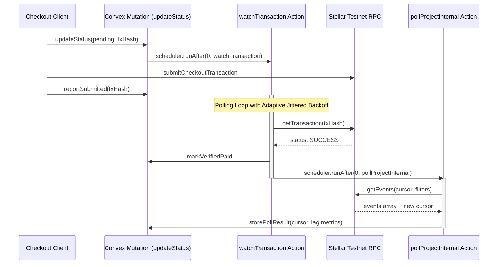

# Sprint 2: Real-Time Confirmation and Event Ingestion

This guide documents the implementation of the Sprint 2 real-time performance enhancements, outlining the backend transaction confirmation fast-path watcher, cursor-based event ingestion, and chunked concurrent polling workers.

## Architectural Overview

We have eliminated the one-minute polling floor for normal-path payments and contract events. The new architecture transitions transactions and event polling into reactive, near-instantaneous processes.



---

## 1. Transaction Fast-Path Confirmation

When the client wallet signs a transaction, the system initiates the fast path:
1. **Pending Transition:** The client sets the payment intent to `pending` and provides the `txHash` to `updateStatus` mutation in `payment_intents/mutations.ts`.
2. **Watcher Scheduling:** `updateStatus` schedules the `watchTransaction` action (`payment_intents/scanner.ts`) to execute asynchronously in the background.
3. **Submission Registration:** Upon successful submission to the Stellar Horizon/RPC network, the client calls the `reportSubmitted` mutation (`transactions/mutation.ts`) which persists the transaction as `"submitted"` in the `transactions` table.
4. **Adaptive Watcher Loop:** The watcher checks the transaction status directly on the Stellar RPC server via `getTransaction` with an adaptive jittered backoff:
   - Starts at 250 ms.
   - Doubles on subsequent attempts (500 ms, 1s, 2s, etc.) up to a cap of 5,000 ms.
   - Adds a random jitter up to 100 ms to prevent concurrent polling waves.
   - Max loop duration is 60 seconds.
5. **Terminal Updates:** If success or failure is returned by the RPC, the watcher transitions the intent state to `paid` or `failed` instantly. If it times out, it exits silently, leaving final verification to the minute-based cron reconciliation.

---

## 2. Cursor-Based Event Ingestion

Contract event polling now tracks exactly where it left off, bypassing unnecessary ledger-checking calls.
1. **Opaque Cursors:** The `pollerState` table stores the opaque pagination `cursor` returned by Stellar RPC `getEvents`.
2. **Bypassing getLatestLedger:** When a cursor is present, the poller queries `getEvents` directly using the cursor and filters, avoiding the sequential HTTP request to `getLatestLedger`.
3. **Continuous Ingestion:** If a query returns 100 events (the batch limit), the poller paginates continuously up to 10 times in a single execution to process any backlog.
4. **Atomic Checkpointing:** We store results and update checkpoints inside a single Convex transaction (`storePollResult` mutation). The cursor checkpoint only commits after all events are successfully stored, ensuring at-least-once delivery guarantees.

---

## 3. Concurrency and Bounded Workers

To handle scalability and network errors gracefully:
1. **Chunked Polling:** `pollScheduled` chunks the list of scheduled projects into batches of 5.
2. **Bounded Workers:** It executes polling concurrently for each project in a batch using `Promise.allSettled`.
3. **Fault Isolation:** A slow project or RPC timeout in one project will not block other projects from polling.

---

## 4. Lag and Telemetry Metrics

We now track ingestion delays directly in `pollerState`:
- **Ledger Lag:** `latestLedger - lastPolledEventLedger`. Represents the difference between the network tip and the latest processed event block.
- **Time Lag:** `observedAt - latestEventTimestamp`. Represents the ingestion delay in milliseconds.

To inspect the current status and metrics of any poller:
```bash
# Query the poller state for a project
pnpm --filter @repo/backend exec convex run poller_state/query:getByScope '{"scope": "project:<projectId>"}'
```
