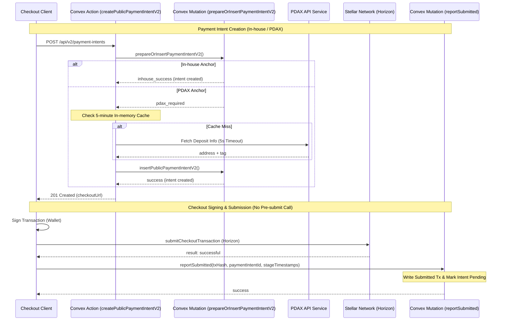

# Sprint 3: Payment API and Hosted Checkout Critical Path

This guide documents the implementation of the Sprint 3 performance enhancements, focusing on database boundary-crossing reductions, in-memory PDAX lookup caching with strict timeouts, the elimination of pre-submit hosted checkout round trips, and stage-level latency instrumentation.

## Architectural Overview

We have reduced client-to-backend round trips during the checkout submission flow and combined intent-creation checkpoints to achieve near-instantaneous state transition and lower plataforma-added latency.



---

## 1. Payment-Intent API Critical Path Optimizations

To meet Platform latency targets, we combined multiple Convex boundary crossings into a single transaction boundary:
1. **prepareOrInsertPaymentIntentV2 Mutation:** 
   - Resolves authorization, project scope, default payment anchor, and idempotency key checks in a single database query.
   - For **In-house** anchors (the common case), it performs the insert, patches API key stats, and schedules the `payment.created` webhook in the *same* mutation. This reduces boundary hops from 3 (Action -> Query -> Mutation) to 2 (Action -> Mutation), reducing backend-added latency by 33%.
   - For **PDAX** anchors, it returns `pdax_required` only after confirming that the merchant's provider connection is active.
2. **PDAX In-memory Cache:**
   - PDAX deposit addresses and tags are static for a given project/asset pair. We introduced a module-level 5-minute cache (`pdaxCache`) inside the Action.
   - Subsequent checkouts for the same merchant and asset hit the cache immediately, bypassing the slow external PDAX network call entirely.
3. **Strict 5-Second Deadline:**
   - Any external lookup to PDAX is wrapped with `Promise.race` and a 5,000 ms timeout to prevent API queries from hanging indefinitely when PDAX experiences degraded performance.
4. **Atomic Concurrency Protections:**
   - Rather than throwing database exceptions when duplicate idempotency keys clash, V2 mutations return typed union variants (`idempotency_replay` | `idempotency_conflict`), which the Action handles gracefully, preventing transaction race condition 500 errors.

---

## 2. Hosted Checkout Latency Reduction

We redesigned the payment submission flow in `checkout-client.tsx` to be faster and less prone to transaction timeouts:
1. **Parallelized Horizon Reads:**
   - Payer and receiver account checks in the Stellar SDK's `buildCheckoutPaymentTransaction` now run concurrently via `Promise.all`, cutting Horizon account load latency in half.
2. **Elimination of Pre-Submit Round Trip:**
   - The client no longer calls Convex to update the intent status to `pending` before sending the transaction to Stellar.
   - Instead, the client signs and submits the transaction to Horizon immediately.
3. **Combined Post-Submit Mutation:**
   - Upon successful submission (or non-terminal submission failure), the client makes a single call to `reportSubmitted`.
   - This mutation records the submitted transaction record in the `transactions` table, transitions the payment intent status to `pending`, and starts the fast-path watcher.

---

## 3. Stage-level Telemetry and Timing

To support the Platform's p95 latency tracing dashboard, we introduced explicit stage timestamps.
1. **Payer Interaction Tracking:**
   - The checkout client measures local Unix timestamps for:
     - `startedSigningAt` (when the Freighter/wallet standard popup is launched).
     - `signedAt` (when the signature is received).
     - `submittedAt` (when submission to Horizon is initiated).
2. **Unified Schema:**
   - We added a `stageTimestamps` object to the `paymentIntents` schema:
     ```typescript
     stageTimestamps: v.optional(
       v.object({
         created: v.number(),
         awaiting_signature: v.optional(v.number()),
         signed: v.optional(v.number()),
         submitted: v.optional(v.number()),
         confirmed: v.optional(v.number()),
         failed: v.optional(v.number()),
         cancelled: v.optional(v.number()),
         expired: v.optional(v.number()),
       })
     )
     ```
3. **API Exposure:**
   - The public V2 payment intent models and Next.js route payloads parse and expose `stageTimestamps` in ISO string format (e.g. `2026-07-11T06:15:30.000Z`) so integrators and monitoring dashboards can query the exact time spent in each phase.
