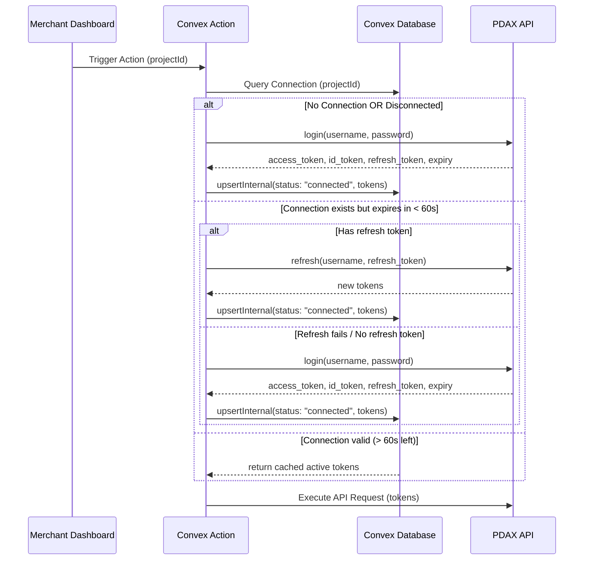

# PDAX UAT Settlement Workflow Documentation

This document explains the technical implementation of **Velo Settlement**'s PDAX UAT integration (Sprint 2).

## Core Architecture

Velo Settlement coordinates regional fiat-stablecoin conversions and payouts. The architecture comprises:
1. **`@repo/pdax` Client**: A server-only client wrapping programmatic endpoints for connection, pricing, execution, and InstaPay withdrawals.
2. **Convex Database Tables**:
   - `providerConnections`: Caches programmatic session tokens (`accessToken`, `idToken`, `refreshToken`) per project.
   - `settlementQuotes`: Stores executable firm quotes.
   - `settlementTransactions`: Tracks the lifecycle of the conversion and payout workflow.
3. **Convex Actions**: Expose public/internal methods to perform network requests, manage credentials, and transition records.

---

## Connection and Session Management

Tokens last 10 minutes (600 seconds) in UAT. To prevent programmatic login overhead and avoid provider rate limits, session tokens are cached in the `providerConnections` table:



---

## Action Workflow and Status Lifecycle

The settlement lifecycle transitions through state changes stored in the `settlementTransactions` table:

```txt
[Indicative Quote] (No DB record)
  ↓
[Firm Quote] (QUOTE_FIRM)
  ↓
[Execute Trade] (TRADE_EXECUTED)
  ↓
[Fiat Payout] (PAYOUT_PENDING)
```

### 1. Quotes (`getQuote`)
- **Indicative Quote**: Returns estimated prices and rates. Not stored.
- **Firm Quote**: Executable for 15 seconds. Saves the quote to `settlementQuotes` with status `"active"` and creates a settlement transaction with status `"QUOTE_FIRM"`. Includes optional paid `paymentIntentId` verification.

### 2. Trade Execution (`executeTrade`)
- Checks quote expiry and status.
- Executes conversion on-chain/programmatically on PDAX.
- Marks the quote as `"executed"`.
- Updates the transaction status to `"TRADE_EXECUTED"` and stores `orderId` and `tradeDetails`.

### 3. InstaPay Withdrawal (`fiatWithdraw`)
- Triggers a fiat withdrawal via InstaPay rails using global merchant mock credentials.
- Creates or updates the transaction record to `"PAYOUT_PENDING"`, saving `withdrawalId` and `withdrawalDetails`.

---

## Supported Rails & Constants

- **Payout rails**: InstaPay UAT
- **UAT Test Banks**:
  - Security Bank: `BASECPH`
  - CTBC Bank: `BACTBPH`
- **Supported pair**: `USDCXLM` -> `PHP` (Selling USDC on Stellar Testnet for Philippine Pesos).

---

## Idempotency Protections

Each state mutation action requires an `idempotencyId`. If a request is retried:
1. The backend queries `settlementTransactions` by `idempotencyId`.
2. If a matching record is found, it returns the cached result without making duplicate requests to the PDAX API.
