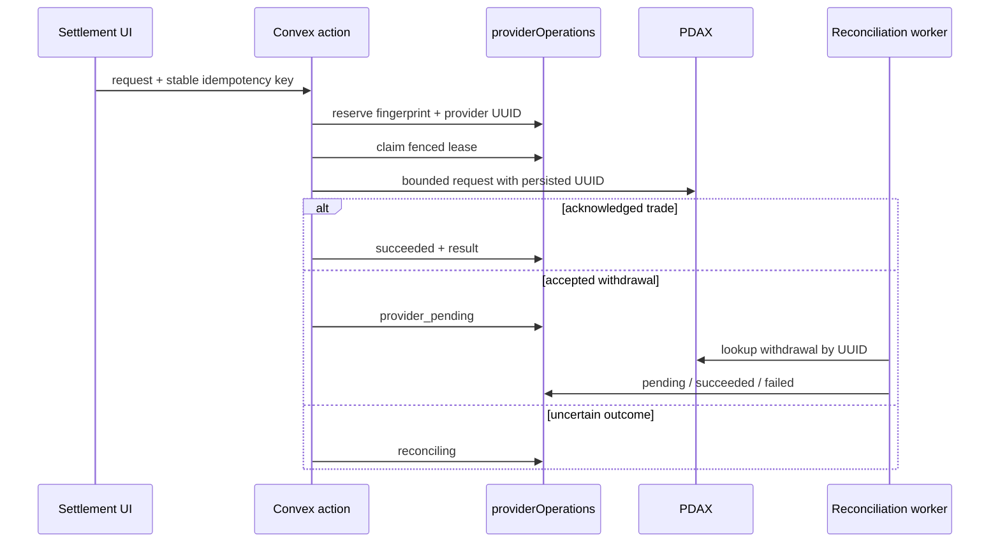

# PDAX Settlement Workflow

## Overview

Velo uses `@repo/pdax` from Convex actions for quotes, trade execution, and fiat payouts. Sprint 8
places provider side effects behind durable `providerOperations` and targets **exactly-once
observable transitions**, not exactly-once transport. See the
[Sprint 8 architecture](../../architecture/sprint-8-durable-financial-reliability.md).

## Trade and withdrawal flow



Exact replays observe the existing row; changed payloads conflict. Reservation convergence is
covered by [`100 concurrent reservations produce one durable provider operation`](../../../packages/backend/convex/durableReliability.test.ts). Lease fencing and the rule that ambiguous trades are never automatically resubmitted are covered by [`lease fencing rejects stale completion and ambiguous trades cannot resubmit`](../../../packages/backend/convex/durableReliability.test.ts).

Action results are `succeeded` with data, `in_progress` with `retryAfterMs`, or
`recovery_required`, always with `operationId`. The UI must retain its idempotency key until the
operation reaches a terminal state; a new key is a new financial operation.

## Callback workflow

The registered callback is:

```text
POST ${PDAX_CALLBACK_URL}/api/webhooks/pdax/v1?token=${PDAX_WEBHOOK_TOKEN}
Content-Type: application/json
```

`registerWebhook({ projectId })` constructs the URL server-side. The ingress checks the token,
limits the body to 64 KiB, and normalizes it with `PdaxClient.parseWebhook`. Duplicate provider
IDs/payload digests converge; unmatched events are quarantined. Because PDAX callbacks are
unsigned, they are hints and cannot independently authorize terminal financial transitions.
Strict normalization is covered by [`normalizes an allowlisted crypto webhook`](../../../packages/pdax/src/client.test.ts), [`normalizes an allowlisted fiat webhook`](../../../packages/pdax/src/client.test.ts), and [`rejects malformed and stale webhook shapes`](../../../packages/pdax/src/client.test.ts).

The legacy Next.js `POST /api/webhooks/pdax` route returns `410 Gone`. Re-register active projects
after deploying the Convex endpoint.

## Merchant events

Velo emits v1 signed settlement/provider events. Immutable domain-event identity plus a unique
`(event, endpoint, schemaVersion)` delivery key gives exactly-once observable delivery transitions
while transport remains at-least-once. Evidence: [`duplicate delivery triggers share one fenced delivery`](../../../packages/backend/convex/durableReliability.test.ts) and [`webhook delivery retry and backoff lifecycle`](../../../packages/backend/convex/webhookDelivery.test.ts).

Sprint 8 contains deterministic automated evidence only. It has no live SLO qualification and no
production availability evidence.
