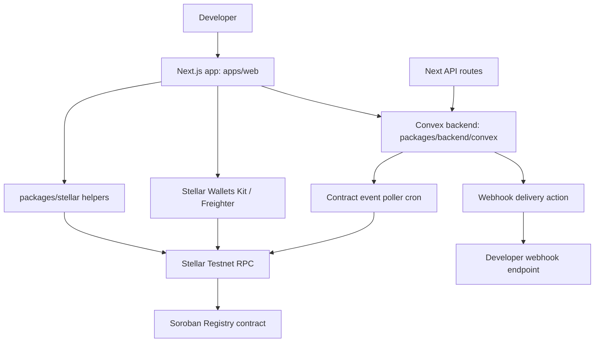
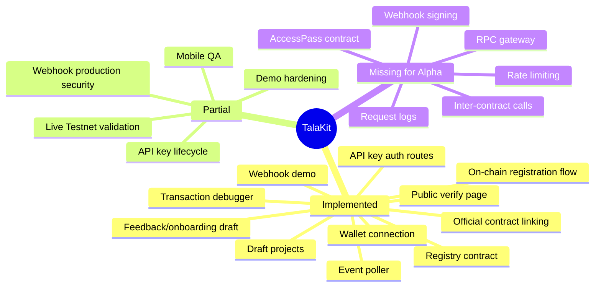

# TalaKit Project Status Report

Generated: 2026-06-29  
Scope: current local worktree under `/home/carts/Documents/Personal/TalaKit`  
Audience: product owner, implementation agents, and developers preparing the Alpha phase

## 1. Executive Summary

TalaKit has moved beyond placeholder planning into a working Phase 1 MVP foundation. The current codebase already implements most of the original **Verify + Debug** loop:

1. Wallet connection through Stellar Wallets Kit on Testnet.
2. Off-chain project creation in Convex.
3. On-chain registry transaction construction, signing, submission, and sync.
4. Official contract add/remove transaction flow.
5. Public verified project page at `/verify/[slug]`.
6. Transaction hash debugger backed by Stellar RPC and Convex cache.
7. Bounded contract event polling for registered project contracts.
8. Webhook configuration, test delivery, automatic trigger hooks, and delivery logs.
9. Project API key generation and read-only developer API routes for events, cached transactions, and webhook deliveries.
10. DemoPay readiness checklist and copy/share affordances.

The codebase is **not yet Alpha-complete** against `docs/prds/prd-talakit02026-06-26/talakit-alpha-spec.md`. The main missing Alpha requirements are:

- second Soroban contract `TalaKitAccessPass`;
- meaningful inter-contract call from AccessPass into Registry;
- full RPC gateway that forwards JSON-RPC methods;
- API key usage tracking, last-used timestamp, request count, revocation metadata, and rate limiting;
- webhook signing and secret generation;
- production hardening around deployed contract IDs, hosted environments, and end-to-end live Testnet validation.

Overall status: **Phase 1 MVP is substantially implemented; Alpha is planned and partially implemented.**

## 2. Evidence Snapshot

Primary sources reviewed:

- `README.md`
- `docs/prds/prd-talakit-2026-06-13/prd.md`
- `docs/prds/prd-talakit-2026-06-13/phase-1-sprint-plan.md`
- `docs/prds/prd-talakit02026-06-26/talakit-alpha-spec.md`
- `apps/web`
- `packages/backend/convex`
- `packages/stellar/src`
- `contracts/registry/src`
- `contracts/registry/tests`

Current worktree note:

- Local worktree has uncommitted additions for feedback, onboarding, user schema, and the Alpha spec.
- Generated file `packages/backend/convex/_generated/api.d.ts` is modified. This report did not edit generated files.

Verification run:

- `pnpm --filter web test`: passed, 2 tests.
- `pnpm --filter @repo/backend test`: passed, 2 tests.
- `pnpm --filter @repo/stellar test`: passed, 4 tests.
- `cd contracts/registry && cargo test`: passed, 11 registry integration tests.

## 3. Current Architecture



Implemented stack:

- Monorepo: pnpm + Turborepo.
- Frontend: Next.js 16, React 19, shared UI package, lucide icons.
- Backend: Convex schema, queries, mutations, actions, cron.
- Stellar integration: `@stellar/stellar-sdk` helpers in `packages/stellar`.
- Smart contract: Soroban Rust registry contract.
- Tests: Node test runner, Vitest, Cargo tests.

## 4. Implemented Features

### 4.1 Wallet Connection

Status: **Implemented for Testnet, needs live wallet QA**

Implemented in:

- `apps/web/core/wallet/wallet-provider.tsx`
- `apps/web/core/config/stellar.ts`
- `apps/web/core/app-shell.tsx`

Current behavior:

- Initializes Stellar Wallets Kit only in browser.
- Uses Testnet network config.
- Supports wallet modal flow and default modules.
- Tracks selected wallet ID/name, connected address, stale stored session, rejected connection, unavailable wallet, unsupported network, disconnect.
- Exposes `connect`, `disconnect`, and `signTransaction`.

Remaining Alpha work:

- Verify all required wallet states against Freighter in browser.
- Add more explicit wrong-network UX if wallet kit events vary by wallet.
- Document supported wallet list and failure modes.

### 4.2 Project Dashboard and Draft Projects

Status: **Implemented**

Implemented in:

- `apps/web/features/projects/dashboard.tsx`
- `apps/web/features/projects/create-project-form.tsx`
- `packages/backend/convex/projects/schema.ts`
- `packages/backend/convex/projects/mutation.ts`
- `packages/backend/convex/projects/query.ts`

Current behavior:

- Owner-wallet-scoped project list.
- Draft project creation.
- Slug generation.
- Metadata JSON preview.
- SHA-256 metadata hash generation.
- Project states: `draft`, `pending_registration`, `registered`, `registration_error`, `stale`.
- Dashboard empty/loading states.

Known limitation:

- Ownership is enforced by comparing submitted wallet address to stored owner address, not by Convex auth identity. This matches wallet-first MVP but is not a full authenticated account model.

### 4.3 On-Chain Registry Contract

Status: **Implemented and tested**

Implemented in:

- `contracts/registry/src/lib.rs`
- `contracts/registry/src/types.rs`
- `contracts/registry/src/events.rs`
- `contracts/registry/src/errors.rs`
- `contracts/registry/tests/registry.rs`

Current behavior:

- `register_project`
- `update_project`
- `add_contract`
- `remove_contract`
- `transfer_ownership`
- `deactivate_project`
- `get_project`
- `get_project_contracts`
- Owner auth enforced by `require_auth`.
- Name length validation.
- Duplicate contract rejection.
- Max 25 contracts per project.
- Missing project errors.
- Observable events for registry mutations.
- Persistent storage TTL extension.

Test coverage:

- 11 Cargo integration tests passed.
- Tests cover registration, add/remove, duplicates, inactive project behavior, transfer, invalid names, missing project reads/mutations, contract limit, unknown contract removal, emitted events, and non-owner rejection.

Remaining Alpha work:

- Deploy/record Testnet registry contract ID.
- Add build/deploy operational notes if not already finalized in `contracts/registry/README.md`.

### 4.4 On-Chain Registration Flow

Status: **Implemented, needs live Testnet validation**

Implemented in:

- `apps/web/features/projects/project-detail.tsx`
- `packages/stellar/src/registry.ts`
- `packages/backend/convex/projects/mutation.ts`

Current behavior:

- Builds `register_project` Soroban transaction.
- Signs with connected wallet.
- Submits signed XDR to Stellar RPC.
- Stores pending registration hash.
- Confirms transaction through RPC.
- Stores `registryProjectId` and `createdLedger` when available.
- Marks stale/error states.
- Triggers webhook events for `project.registered`, `transaction.succeeded`, and `transaction.failed`.

Known limitation:

- Sync depends on `response.returnValue` to extract project ID. Live RPC behavior should be checked with deployed contract.

### 4.5 Official Contract Management

Status: **Implemented, needs live Testnet validation**

Implemented in:

- `apps/web/features/projects/project-contracts.tsx`
- `packages/backend/convex/project_contracts/schema.ts`
- `packages/backend/convex/project_contracts/mutation.ts`
- `packages/backend/convex/project_contracts/query.ts`
- `packages/stellar/src/registry.ts`
- `packages/stellar/src/validation.ts`

Current behavior:

- Add official contract transaction builder.
- Remove official contract transaction builder.
- Wallet signing/submission.
- Convex pending/active/stale/error states.
- Duplicate prevention at backend and contract layer.
- Owner-scoped contract listing.
- Copy actions and confirmation dialog for removal.

Remaining Alpha work:

- Verify contract ID format expectations against actual deployed Soroban contract IDs.
- Add end-to-end demo evidence after registry contract deployment.

### 4.6 Public Verified Project Page

Status: **Implemented**

Implemented in:

- `apps/web/app/verify/[slug]/page.tsx`
- `apps/web/features/projects/public-verification.tsx`
- `packages/backend/convex/projects/query.ts`
- `packages/backend/convex/contract_events/query.ts`

Current behavior:

- Public route `/verify/[slug]`.
- No wallet required.
- Shows project name, description, owner, status, registry project ID, metadata hash, created ledger, last sync, official contract IDs.
- Uses safe public projection.
- Does not expose webhook URL, API key, delivery log detail, raw event payload, or poller error.
- Shows recent public activity from bounded event query.

Spec mismatch:

- Alpha spec example route says `/projects/:projectId`; Phase 1 sprint plan says `/verify/[slug]`. Code follows Phase 1 route.

### 4.7 Transaction Debugger

Status: **Implemented for transaction hash lookup**

Implemented in:

- `apps/web/app/debug/page.tsx`
- `apps/web/features/debugger/transaction-debugger.tsx`
- `packages/backend/convex/transactions/schema.ts`
- `packages/backend/convex/transactions/action.ts`
- `packages/stellar/src/transaction-debugger.ts`

Current behavior:

- Accepts 64-character hex transaction hash.
- Fetches Stellar Testnet RPC.
- Caches lookup result in Convex.
- Displays status, ledger, fee charged, result code, timestamp.
- Decodes operations, contract calls, events where parser supports them.
- Shows failure reason, hint, and raw RPC response.
- Handles not found, pending, RPC unavailable, failed, success, unsupported/decode states.

Deferred:

- XDR paste.
- Deep error explanation engine beyond current hints.
- Project/contract contextual debugger mode.

### 4.8 Contract Event Indexer and Monitor

Status: **Implemented as bounded poller for linked contracts**

Implemented in:

- `packages/backend/convex/contractEventPolling.ts`
- `packages/backend/convex/crons.ts`
- `packages/backend/convex/contract_events/schema.ts`
- `packages/backend/convex/contract_events/query.ts`
- `packages/backend/convex/contract_events/mutation.ts`
- `packages/backend/convex/poller_state/schema.ts`
- `packages/stellar/src/event-monitor.ts`
- `apps/web/features/projects/project-events.tsx`
- `apps/web/features/projects/event-activity.tsx`

Current behavior:

- Polls active official contract IDs.
- Cron interval: 1 minute.
- Supports manual poll from project events screen.
- Stores normalized events with project ID, contract ID, transaction hash, ledger, timestamp, topic, topics, type, raw/decoded payload.
- Tracks poller state: idle, polling, stale, error.
- Dashboard event preview.
- Event monitor filters by contract, event type/topic, transaction hash, ledger.
- Event detail sheet with topics, decoded payload, raw payload.
- Public page gets safe event projection only.

Remaining Alpha work:

- Validate polling behavior against live registered contracts.
- Decide retention policy for event history.
- Add stronger pagination if event volume grows.

### 4.9 Webhooks

Status: **Implemented for demo delivery, not Alpha-secure**

Implemented in:

- `apps/web/features/projects/project-webhooks.tsx`
- `packages/backend/convex/webhook_endpoints/schema.ts`
- `packages/backend/convex/webhook_endpoints/mutation.ts`
- `packages/backend/convex/webhook_endpoints/query.ts`
- `packages/backend/convex/webhook_deliveries/schema.ts`
- `packages/backend/convex/webhook_deliveries/mutation.ts`
- `packages/backend/convex/webhook_deliveries/query.ts`
- `packages/backend/convex/webhookDelivery.ts`

Current behavior:

- Save webhook URL.
- Enable/disable endpoint.
- Select event types.
- Send test webhook.
- Use latest observed contract event for test payload when available.
- Automatic triggers exist for registration/update/transaction outcomes and contract events.
- Delivery log stores destination host, status, HTTP status, failure reason, attempt count, last attempt, payload summary.
- UI shows delivery detail sheet.
- Hosted Convex localhost limitation is surfaced in UI.

Supported event types in current code:

- `contract.event`
- `transaction.succeeded`
- `transaction.failed`
- `project.registered`
- `project.updated`

Alpha spec event list includes:

- `contract.event`
- `transaction.succeeded`
- `transaction.failed`
- `project.registered`
- `contract.added`
- `access.activated`

Remaining Alpha work:

- Add webhook secret generation.
- Add payload signing.
- Add retry policy if Alpha requires more than one attempt.
- Reconcile event type list with Alpha spec.
- Add `contract.added` and `access.activated` after AccessPass work exists.

### 4.10 API Keys and Developer API Routes

Status: **Partially implemented**

Implemented in:

- `packages/backend/convex/projects/mutation.ts`
- `packages/backend/convex/projects/query.ts`
- `apps/web/app/api/v1/events/route.ts`
- `apps/web/app/api/v1/transactions/[hash]/route.ts`
- `apps/web/app/api/v1/webhooks/deliveries/route.ts`
- `apps/web/core/api/auth.ts`

Current behavior:

- Project owner can generate API key.
- Raw key is shown once in UI.
- Stored value is SHA-256 hash.
- UI stores/display prefix only.
- API key can be revoked by clearing hash/prefix fields.
- Developer API supports:
  - `GET /api/v1/events`
  - `GET /api/v1/transactions/[hash]`
  - `GET /api/v1/webhooks/deliveries`
- API key accepted from `Authorization: Bearer` or `x-api-key`.

Remaining Alpha work:

- Store API key as dedicated `APIKey` table if multiple keys/labels are required.
- Track `last_used_at`.
- Track request count.
- Store revoked state rather than deleting fields, if audit trail matters.
- Add labels.
- Add rate limiting.
- Add route-level request logging.

### 4.11 RPC Gateway

Status: **Not implemented as Alpha requires**

Current code has developer API routes and direct Stellar RPC calls from helpers/actions, but no endpoint like:

```txt
https://rpc.talakit.xyz/testnet/YOUR_API_KEY
```

Missing Alpha gateway behavior:

- JSON-RPC forwarding.
- Supported method allowlist.
- API key authentication on gateway requests.
- Request method logs.
- Request timestamp logs.
- Response status logs.
- Latency logs.
- Project ID and API key ID logs.
- Error logs.
- Basic rate limiting.
- Health check endpoint.

### 4.12 Feedback and Onboarding

Status: **New/uncommitted feature area**

Implemented or staged in:

- `apps/web/app/feedback/page.tsx`
- `apps/web/features/feedback/*`
- `apps/web/features/onboarding/*`
- `packages/backend/convex/feedback/*`
- `packages/backend/convex/users/*`

Current purpose:

- Collect user feedback tied to wallet address.
- Store user profile/onboarding info.

Status note:

- These files are currently uncommitted in worktree. Treat as active implementation work until reviewed and committed.

## 5. Sprint Status Against Phase 1 Plan

| Sprint | Planned outcome | Current status |
| --- | --- | --- |
| 0 Product and Dev Readiness | Routes, env, data contracts, placeholders | Complete |
| 1 Registry Foundation | Registry contract complete/tested | Complete |
| 2 Project System and Multi-Wallet | Wallet + draft projects | Mostly complete |
| 3 On-Chain Registration Flow | Register draft on-chain and sync | Implemented, needs live deployed validation |
| 4 Contract Linking and Public Proof | Add/remove contracts + public page | Implemented, needs live deployed validation |
| 5 Transaction Debugger | Inspect Testnet hash | Implemented |
| 6 Event Monitor | Poll/display recent linked-contract events | Implemented, needs live data validation |
| 7 Webhook Demo | Configure endpoint + delivery logs | Implemented for demo |
| 8 Demo Hardening | Checklist, copy actions, states, setup | Partially complete |

Phase 1 overall: **near MVP-complete, pending environment/deployment/live-flow validation.**

## 6. Alpha Status Against New Alpha Spec

| Alpha requirement | Status | Notes |
| --- | --- | --- |
| Production-ready MVP | Partial | Functional MVP exists; production hardening remains |
| Stable frontend architecture | Partial | Feature modules are coherent; live QA still needed |
| Stable smart contract architecture | Partial | Registry stable; AccessPass missing |
| Mobile responsive UI | Partial | Components use responsive layouts; needs viewport QA |
| Proper loading states | Mostly implemented | Main flows include skeleton/empty/loading states |
| Proper error handling | Mostly implemented | Main flows include failure states; live edge cases remain |
| Inter-contract calls with 2+ contracts | Not implemented | Only `TalaKitRegistry` exists |
| Working RPC gateway | Not implemented | API routes exist, not JSON-RPC gateway |
| Working contract event indexer | Implemented, needs live validation | Bounded poller exists |
| Working transaction debugger | Implemented | Hash-only; XDR deferred |
| Working webhook config and logs | Implemented for demo | Signing/retries missing |

## 7. Key Gaps Before Alpha Phase

### Priority 1: Smart Contract Alpha Gap

Build `TalaKitAccessPass` contract.

Required:

- `activate_access(project_id)`
- `consume_credit(project_id, amount)`
- `get_access_status(project_id)`
- `get_project_credits(project_id)`
- `deactivate_access(project_id)`
- Inter-contract call to `TalaKitRegistry.get_project(project_id)`.
- Check project exists and active.
- Enforce owner activation.
- Tests for active/inactive/missing project paths.
- Deployment docs and Testnet ID.

### Priority 2: RPC Gateway

Build real gateway endpoint.

Required:

- Route shape for Testnet gateway.
- API key auth.
- JSON-RPC method allowlist.
- Forward to Stellar RPC.
- Log method/status/latency/errors/project/API key.
- Basic rate limit.
- Health endpoint.
- Dashboard request logs.

### Priority 3: API Key Model

Move from single hash on project to Alpha-grade API key records if multiple keys or audit trail are required.

Needed fields:

- ID.
- Project ID.
- Key hash.
- Label.
- Created timestamp.
- Last used timestamp.
- Revoked boolean.
- Request count.

### Priority 4: Webhook Security

Add:

- webhook secret;
- signature header;
- payload signing docs;
- retry policy or explicit Alpha deferral;
- event type reconciliation with Alpha spec.

### Priority 5: Live Demo/Deployment Readiness

Needed:

- deployed Registry contract ID in env;
- deployed AccessPass contract ID after build;
- working Convex deployment;
- public HTTPS webhook tester or tunnel;
- sample registered project;
- sample official contract with events;
- timed DemoPay run-through.

## 8. Risk Register

| Risk | Impact | Mitigation |
| --- | --- | --- |
| AccessPass not started | Blocks Alpha mandatory inter-contract requirement | Prioritize second contract before UI polish |
| RPC gateway absent | Blocks Alpha mandatory gateway requirement | Build minimal allowlisted proxy first |
| API keys stored on project | Limits multiple keys, labels, usage logs | Introduce `apiKeys` table |
| Wallet owner auth is address-based | Users can call Convex mutations with claimed address if not guarded by signed proof | Add signed wallet challenge or Convex auth before production |
| Live registry sync unverified | On-chain flow may fail in real wallet/RPC conditions | Deploy and run DemoPay flow on Testnet |
| Event polling live behavior unknown | Demo activity may appear stale/empty | Prepare known contract/event fixture |
| Webhook signing missing | Production consumers cannot verify payload authenticity | Add HMAC signing before Alpha public use |
| Generated Convex file modified | Manual edits could be overwritten or stale | Regenerate with Convex tooling, avoid manual generated edits |

## 9. Recommended Next Implementation Order

1. Build and test `TalaKitAccessPass`.
2. Deploy Registry and AccessPass to Testnet; record contract IDs.
3. Wire AccessPass activation into project dashboard and readiness checklist.
4. Implement minimal RPC gateway with API key auth, allowlist, and request logs.
5. Replace single project API key fields with `apiKeys` table if Alpha requires labels and usage metrics.
6. Add webhook secrets/signatures.
7. Run full DemoPay live flow: create project, register, activate access, add contract, poll event, debug transaction, send webhook.
8. Run mobile/responsive pass on dashboard, project detail, events, webhooks, public page, debugger.
9. Update docs with deployed IDs, known limitations, and demo setup.

## 10. Current Feature Map



## 11. Bottom Line

TalaKit already has a coherent and runnable Phase 1 MVP architecture. The implementation covers the original Verify + Debug product loop at code level. The new Alpha phase should not restart the project; it should extend the current foundation with the mandatory Alpha platform pieces:

- second contract and inter-contract verification;
- real RPC gateway;
- stronger API key model;
- webhook security;
- live deployment validation.

The fastest path is to treat the existing Phase 1 code as the base and implement Alpha as a hardening/extension phase, not a rewrite.
