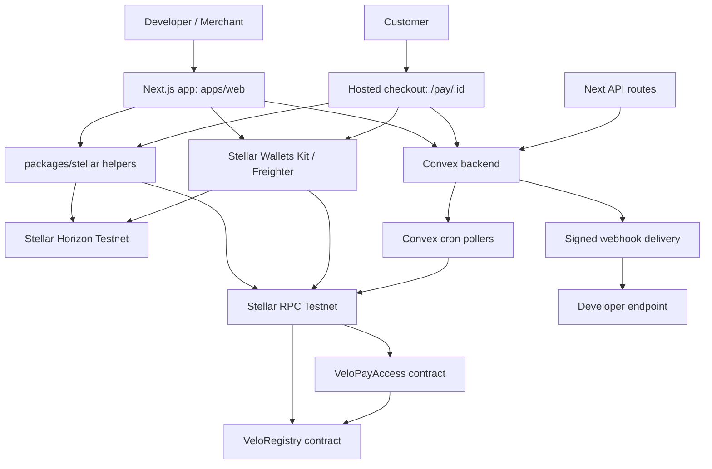
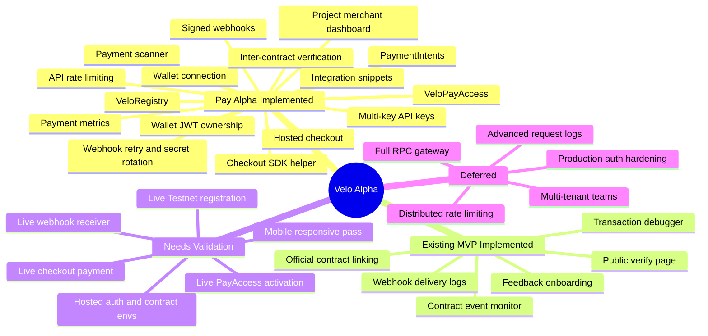

# Velo Project Status Report

Generated: 2026-06-29  
Updated: 2026-07-01  
Scope: current local worktree under `/home/carts/Documents/Personal/Velo`  
Audience: product owner, implementation agents, and developers reviewing Alpha readiness

## 1. Executive Summary

The Alpha sprint has moved Velo from a Phase 1 Verify + Debug MVP into a demoable **Velo Pay** alpha. The current codebase implements the pay-prioritized Alpha flow from `docs/prds/prd-talakit02026-06-26/talakit-alpha-spec-pay-prioritized.md`:

1. Developer connects a Stellar Testnet wallet.
2. Developer creates a project / merchant profile.
3. Developer registers the project on-chain through `VeloRegistry`.
4. Developer activates payment access through `VeloPayAccess`, which calls `VeloRegistry.get_project`.
5. Developer generates hashed project API keys.
6. Developer creates PaymentIntents through `POST /api/v1/payment-intents`.
7. Customer opens hosted checkout at `/pay/[paymentIntentId]`.
8. Customer connects wallet and submits a Stellar payment transaction.
9. Velo updates payment status, polls pending payments, records metrics, and sends signed webhooks.
10. Developer reviews project status, payment logs, event logs, webhook logs, and integration snippets.

Post-gap status as of 2026-07-01: **Pay-prioritized Alpha is substantially implemented at code level and covered by focused unit/integration tests.** The latest work closed five previously documented hardening gaps:

- Hosted contract IDs are validated, normalized, and required for hosted environments.
- Checkout no longer marks a successful Horizon submission as paid; only backend ledger verification can mark an intent paid.
- Convex ownership checks now use wallet-auth JWT identity and `ownerTokenIdentifier`, with legacy address fallback for migration.
- Webhooks now support signing secret rotation and retry/backoff up to five attempts.
- Public API routes now use a lightweight in-memory rate limiter with API-key and cached project-level buckets.

Live Testnet deployment and full end-to-end demo validation remain the main readiness gate.

The older broad Alpha spec in `talakit-alpha-spec.md` still includes production RPC gateway, request logs, rate limiting, and broader developer-ops infrastructure. Those are **deferred by the pay-prioritized revision** and should not be treated as blockers for the hackathon Alpha unless the product direction changes again.

## 2. Evidence Snapshot

Primary sources reviewed:

- Alpha specs and sprint plan:
  - `docs/prds/prd-talakit02026-06-26/talakit-alpha-spec-pay-prioritized.md`
  - `docs/prds/prd-talakit02026-06-26/talakit-alpha-spec.md`
  - `docs/prds/prd-talakit02026-06-26/talakit-alpha-sprint-plan.md`
- Web app:
  - `apps/web/app`
  - `apps/web/features/projects`
  - `apps/web/features/checkout`
  - `apps/web/features/debugger`
  - `apps/web/core`
- Convex backend:
  - `packages/backend/convex/schema.ts`
  - `packages/backend/convex/projects`
  - `packages/backend/convex/api_keys`
  - `packages/backend/convex/payment_intents`
  - `packages/backend/convex/webhook_*`
  - `packages/backend/convex/contract_events`
  - `packages/backend/convex/payAccessSync.ts`
  - `packages/backend/convex/crons.ts`
- Stellar helpers:
  - `packages/stellar/src/registry.ts`
  - `packages/stellar/src/pay-access.ts`
  - `packages/stellar/src/checkout.ts`
  - `packages/stellar/src/webhook.ts`
  - `packages/stellar/src/event-monitor.ts`
  - `packages/stellar/src/transaction-debugger.ts`
- Soroban contracts:
  - `contracts/registry`
  - `contracts/pay_access`

Coverage artifacts found:

- Web tests:
  - `apps/web/features/checkout/checkout-client.test.ts`
  - `apps/web/features/projects/demo-readiness.test.ts`
  - `apps/web/features/api/rate-limit.test.ts`
  - `apps/web/features/config/env.test.ts`
- Backend tests:
  - `packages/backend/convex/apiKey.test.ts`
  - `packages/backend/convex/paymentIntent.test.ts`
  - `packages/backend/convex/tasks.test.ts`
  - `packages/backend/convex/webhookDelivery.test.ts`
- Stellar helper tests:
  - `packages/stellar/src/auth.test.ts`
  - `packages/stellar/src/checkout.test.ts`
  - `packages/stellar/src/contract-config.test.ts`
  - `packages/stellar/src/event-monitor.test.ts`
  - `packages/stellar/src/webhook.test.ts`
- Contract integration tests:
  - `contracts/registry/tests/registry.rs`
  - `contracts/pay_access/tests/pay_access.rs`

Verification run on 2026-07-01:

- `pnpm --filter web test`: passed, 13 tests.
- `pnpm --filter @repo/backend test`: passed, 5 files / 11 tests.
- `pnpm --filter @repo/stellar test`: passed, 25 tests.
- `cd contracts/registry && cargo test`: passed, 11 integration tests.
- `cd contracts/pay_access && cargo test`: passed, 5 integration tests.

## 3. Current Architecture



Implemented stack:

- Monorepo: pnpm + Turborepo.
- Frontend: Next.js 16, React 19, shared UI package, lucide icons.
- Backend: Convex schema, queries, mutations, actions, internal actions, and cron jobs.
- Stellar integration: `@stellar/stellar-sdk` helpers in `packages/stellar`.
- Smart contracts: Soroban Rust `VeloRegistry` and `VeloPayAccess`.
- Tests: Node test runner, Vitest with `convex-test`, and Cargo integration tests with snapshots.

## 4. Alpha Feature Coverage Matrix

| Alpha area | Implementation status | Coverage status | Notes |
| --- | --- | --- | --- |
| Wallet connection | Implemented | Manual QA still needed | Browser-only Stellar Wallets Kit flow, Testnet config, connect/disconnect/sign states. |
| Project / merchant dashboard | Implemented | Backend exercised indirectly | Owner-wallet project CRUD, project detail, verification status, readiness, stats. |
| `VeloRegistry` contract | Implemented | Covered by Cargo tests | Registration, updates, official contracts, ownership, inactive state, events, errors. |
| `VeloPayAccess` contract | Implemented | Covered by Cargo tests | Inter-contract call to Registry, activation/deactivation, credits, owner auth, errors. |
| Payment access activation UI | Implemented | Needs live wallet/RPC validation | Builds/signs/submits `activate_payments`, syncs off-chain status. |
| Multi-key API keys | Implemented | Covered by Convex test | Hashed storage, prefixes, labels, revoke, request count, last used. |
| PaymentIntent API | Implemented | Covered by Convex test | `POST /api/v1/payment-intents`, API-key auth, checkout URL response. |
| Hosted checkout page | Implemented | Formatter tests only | Customer UI handles loading, invalid, expired, pending, success, cancel, failed states. |
| Checkout Stellar payment | Implemented | SDK helper covered with mocked fetch; live payment not covered | Builds Horizon payment transaction, validates trustlines/balance, signs via wallet, submits to Horizon. |
| Checkout SDK helper | Implemented | Covered by Node test | `createCheckoutSession` helper and integration snippet generator. |
| Payment scanner | Implemented | Partially covered through backend scanner test | Cron polls pending PaymentIntents and verifies hashes through transaction lookup helper. |
| Payment metrics | Implemented | Covered by Convex stats test | Volume, counts, recent payments, webhook success rate, average latency. |
| Webhook settings | Implemented | Manual UI QA still needed | Endpoint URL, enabled flag, event selection, signing secret generation. |
| Signed webhooks | Implemented | Verification helper covered by Node test | HMAC-SHA256 `x-velo-signature`, event/delivery headers, response time logging. |
| Webhook delivery logs | Implemented | Backend path exercised indirectly | Pending/success/failed, HTTP status, failure reason, destination host, payload summary, payment intent ID. |
| Contract event monitor | Implemented | Stellar parser covered by tests | Cron and manual polling for official contracts; event UI and public projection. |
| Transaction debugger | Implemented | Helper coverage exists through package tests | Hash lookup, RPC cache, status/result display, raw response and hints. |
| Public verification page | Implemented | Manual route QA still needed | `/verify/[slug]`, safe projection, official contracts, recent public activity. |
| Feedback and onboarding | Implemented as supporting product surface | Not Alpha-critical | Feedback form/list and user profile/onboarding modules are present. |
| Full RPC gateway | Deferred | Not covered | Deferred by pay-prioritized Alpha. |
| Rate limiting | Implemented for current API routes | Covered by web test | In-memory API-key bucket, cached project bucket, `429`, `Retry-After`, and rate-limit headers. |
| Production hardening | Partial | Focused tests added; deployment validation still needed | Contract ID guardrails, wallet JWT ownership, checkout settlement semantics, webhook retry/rotation, and rate limiting are implemented. Hosted Convex/Vercel envs and live Testnet dry run still need validation. |

## 5. Implemented Features

### 5.1 Wallet Connection

Status: **Implemented for Testnet; needs live wallet QA**

Implemented in:

- `apps/web/core/wallet/wallet-provider.tsx`
- `apps/web/core/config/stellar.ts`
- `apps/web/core/app-shell.tsx`
- Checkout and project flows that call `wallet.connect` and `wallet.signTransaction`

Current behavior:

- Initializes Stellar Wallets Kit in the browser.
- Uses Testnet network configuration.
- Tracks selected wallet, connected address, stale session, rejected connection, unavailable wallet, unsupported network, disconnect, and signing.
- Gates owner-only project pages and checkout payment submission behind wallet state.
- Supports message signing for wallet-auth challenge verification.

Coverage:

- `packages/stellar/src/auth.test.ts` covers accepted Stellar signature encodings and malformed signature rejection.
- Browser-wallet interaction still needs manual QA.
- Needs Freighter desktop/mobile QA against live Testnet.

### 5.2 Project / Merchant Dashboard

Status: **Implemented**

Implemented in:

- `apps/web/app/dashboard/page.tsx`
- `apps/web/app/projects/new/page.tsx`
- `apps/web/app/projects/[projectId]/page.tsx`
- `apps/web/features/projects/dashboard.tsx`
- `apps/web/features/projects/create-project-form.tsx`
- `apps/web/features/projects/project-detail.tsx`
- `packages/backend/convex/projects/schema.ts`
- `packages/backend/convex/projects/mutation.ts`
- `packages/backend/convex/projects/query.ts`

Current behavior:

- Owner-wallet-scoped project list.
- Draft project creation and update.
- Slug generation and uniqueness checks.
- Metadata JSON preview and SHA-256 metadata hash generation.
- Registration status tracking: `draft`, `pending_registration`, `registered`, `registration_error`, `stale`.
- Payment access fields: `paymentAccessActive`, `checkoutCredits`, `paymentAccessLastSyncAt`.
- Project detail dashboard with registry info, API keys, payment access, payment metrics, recent payments, recent events, webhook summary, and demo readiness.

Coverage:

- Project creation is exercised by Convex API key and PaymentIntent tests.
- Demo readiness logic has a focused web test.

Security hardening:

- Wallet authentication is implemented through SEP-10 Web Authentication (challenge creation, transaction envelope signature verification, domain-binding, and timebounds) and custom ES256 JWT issuance in `apps/web/core/auth/wallet-jwt.ts` and `apps/web/app/api/auth/wallet/*`.
- Convex uses `packages/backend/convex/auth.config.ts` to trust the wallet JWT issuer/JWKS.
- Project ownership checks now prefer `identity.tokenIdentifier` and persist it as `ownerTokenIdentifier`. Existing records without `ownerTokenIdentifier` can still migrate through a legacy subject/address match, then get patched with the token identifier.
- Remaining production consideration: local/dev fallback secrets exist for non-production convenience; hosted environments must provide `VELO_AUTH_CHALLENGE_SECRET` and `VELO_AUTH_JWT_PRIVATE_KEY_PEM`.

### 5.3 `VeloRegistry` Contract

Status: **Implemented and tested**

Implemented in:

- `contracts/registry/src/lib.rs`
- `contracts/registry/src/types.rs`
- `contracts/registry/src/events.rs`
- `contracts/registry/src/errors.rs`
- `contracts/registry/tests/registry.rs`

Current behavior:

- Registers projects with owner, name, metadata hash, active/verified state, and created ledger.
- Updates project metadata.
- Adds/removes official contract IDs.
- Transfers ownership.
- Deactivates projects.
- Reads project records and official contract lists.
- Enforces owner `require_auth`.
- Enforces name length, duplicate contract prevention, missing project errors, inactive project rules, and a 25-contract limit.
- Emits observable mutation events and extends storage TTL.

Coverage:

- Cargo integration tests cover registration, add/remove contracts, duplicates, inactive projects, ownership transfer, invalid names, missing reads/mutations, contract limit, unknown removal, events, and non-owner mutation rejection.

### 5.4 `VeloPayAccess` Contract

Status: **Implemented and tested**

Implemented in:

- `contracts/pay_access/src/lib.rs`
- `contracts/pay_access/src/types.rs`
- `contracts/pay_access/src/events.rs`
- `contracts/pay_access/src/errors.rs`
- `contracts/pay_access/tests/pay_access.rs`
- `contracts/pay_access/README.md`
- `packages/stellar/src/pay-access.ts`
- `packages/backend/convex/payAccessSync.ts`

Current behavior:

- Initializes with a Registry contract address.
- `activate_payments(project_id)` calls `VeloRegistry.get_project(project_id)` and requires the project to exist and be active.
- Requires project owner auth before activation.
- Grants default checkout credits.
- Supports `deactivate_payments`, `consume_checkout_credit`, `get_payment_access_status`, and `get_checkout_credits`.
- Emits activation, deactivation, credit consumption, and initialization events.
- Convex cron polls the PayAccess contract and syncs payment access state back to projects.

Coverage:

- Cargo tests cover valid activation, Registry inter-contract read, inactive project rejection, missing project rejection, non-owner rejection, credit consumption, invalid credit amount, overdraft, and status queries.

Remaining validation:

- Confirm deployed Testnet `VeloPayAccess` ID and Registry ID in hosted envs.
- Run the dashboard activation flow with a real wallet and live RPC.

Contract ID guardrails:

- `packages/stellar/src/contract-config.ts` validates and normalizes public Registry/PayAccess contract IDs.
- `apps/web/core/config/env.ts` requires hosted contract IDs when `VELO_REQUIRE_CONTRACT_IDS=true` or `VERCEL_ENV=production`.
- `resolveBackendPayAccessContractId` rejects missing backend PayAccess config instead of falling back to a hardcoded ID.
- `apps/web/features/config/env.test.ts` and `packages/stellar/src/contract-config.test.ts` cover valid IDs, malformed IDs, hosted required IDs, backend preference, public fallback for local compatibility, and absent-ID rejection.

### 5.5 On-Chain Project Registration

Status: **Implemented; needs live Testnet validation**

Implemented in:

- `apps/web/features/projects/project-detail.tsx`
- `packages/stellar/src/registry.ts`
- `packages/backend/convex/projects/mutation.ts`

Current behavior:

- Builds a Soroban `register_project` transaction.
- Requests wallet signature.
- Submits signed XDR through Stellar RPC.
- Stores pending transaction hash.
- Confirms transaction and stores `registryProjectId` and `createdLedger` when available.
- Marks stale/error states.
- Triggers registration and transaction webhooks.

Coverage:

- Contract behavior is tested at the Rust layer.
- Full browser-wallet-RPC flow is not automated.

### 5.6 Official Contract Management

Status: **Implemented; needs live Testnet validation**

Implemented in:

- `apps/web/app/projects/[projectId]/contracts/page.tsx`
- `apps/web/features/projects/project-contracts.tsx`
- `packages/backend/convex/project_contracts/*`
- `packages/stellar/src/registry.ts`
- `packages/stellar/src/validation.ts`

Current behavior:

- Adds/removes official contract IDs through Soroban transaction builders.
- Tracks pending, active, stale, and error states in Convex.
- Prevents duplicates in backend and contract layers.
- Supports owner-scoped listing, copy actions, and removal confirmation UI.

Coverage:

- Contract-level behavior is covered by Registry tests.
- UI/RPC live flow still needs demo validation.

### 5.7 API Key Lifecycle

Status: **Implemented and tested**

Implemented in:

- `packages/backend/convex/api_keys/schema.ts`
- `packages/backend/convex/projects/mutation.ts`
- `packages/backend/convex/projects/query.ts`
- `apps/web/features/projects/project-detail.tsx`
- `apps/web/core/api/auth.ts`

Current behavior:

- Dedicated `apiKeys` table.
- Supports multiple API keys per project.
- Generates raw `tk_live_<32 hex>` keys and shows the raw key once.
- Stores SHA-256 hash, prefix, label, created timestamp, revoked flag, request count, and last used timestamp.
- Supports revocation without deleting records.
- Accepts API keys from `Authorization: Bearer` or `x-api-key`.

Coverage:

- `packages/backend/convex/apiKey.test.ts` covers generating multiple keys, hashing, prefixes, labels, valid/invalid authorization, revocation, and active-key behavior after revocation.

Known limitation:

- No explicit rate limiting is implemented.

### 5.8 PaymentIntents and Hosted Checkout

Status: **Implemented**

Implemented in:

- `packages/backend/convex/payment_intents/schema.ts`
- `packages/backend/convex/payment_intents/mutations.ts`
- `packages/backend/convex/payment_intents/queries.ts`
- `packages/backend/convex/payment_intents/scanner.ts`
- `apps/web/app/api/v1/payment-intents/route.ts`
- `apps/web/app/pay/[paymentIntentId]/page.tsx`
- `apps/web/app/pay/[paymentIntentId]/success/page.tsx`
- `apps/web/app/pay/[paymentIntentId]/cancel/page.tsx`
- `apps/web/app/pay/[paymentIntentId]/failed/page.tsx`
- `apps/web/features/checkout/checkout-client.tsx`
- `packages/stellar/src/checkout.ts`

Current behavior:

- API-key-authenticated `POST /api/v1/payment-intents`.
- Creates PaymentIntent records with amount, asset, receiver, merchant name, optional description, optional redirect URLs, status, expiry, payer, and transaction hash.
- Uses project owner address as receiver for Alpha security.
- Requires active payment access before API-created PaymentIntents are authorized.
- Hosted checkout page displays merchant, amount, asset, receiver, network, timer, wallet connection, pay action, pending state, expired state, invalid-link state, and terminal landing screens.
- Checkout transaction helper builds Stellar payment transaction, validates payer/receiver difference, amount, trustlines, and balance, then submits signed XDR through Horizon.
- Pending payment scanner runs every minute and verifies pending transaction hashes.
- Payment stats aggregate counts, paid volume, recent payments, webhook success rate, and average latency.

Coverage:

- `packages/backend/convex/paymentIntent.test.ts` covers activation prerequisite, API key verification, PaymentIntent creation, optional redirect URLs, state transitions, project listing, stats aggregation, and scanner execution path.
- `packages/stellar/src/checkout.test.ts` covers `createCheckoutSession` request shape, missing API key, and API failure handling.
- `apps/web/features/checkout/checkout-client.test.ts` covers checkout formatting helpers.

Settlement hardening:

- Checkout submission now marks the intent `pending` after signed XDR hash extraction. A successful Horizon submission moves the UI to a submitted/processing state only.
- The public `updateStatus` mutation rejects `paid`. Only internal `markVerifiedPaid` can mark a PaymentIntent paid after backend ledger verification through the scanner.
- The scanner verifies pending transaction hashes through `lookupTestnetTransaction`, marks verified successes paid, marks failures failed, and fails stale pending intents after the timeout path.

Known limitation:

- Live payment flow still needs Testnet wallet and funded-account QA.

### 5.9 Checkout SDK and Integration Snippets

Status: **Implemented**

Implemented in:

- `packages/stellar/src/checkout.ts`
- `apps/web/app/projects/[projectId]/integration/page.tsx`
- `apps/web/features/projects/project-integration.tsx`

Current behavior:

- Exports `createCheckoutSession`.
- Dashboard integration page generates Node fetch, SDK helper, Next.js route, and curl examples.
- Snippets use selected active API key prefix/placeholder and current app origin.
- Copy controls are available for snippets.

Coverage:

- SDK helper has focused Node tests.
- Snippet UI needs manual copy/paste validation.

### 5.10 Webhooks and Signed Delivery

Status: **Implemented**

Implemented in:

- `apps/web/app/projects/[projectId]/webhooks/page.tsx`
- `apps/web/features/projects/project-webhooks.tsx`
- `apps/web/app/api/webhook-tester/route.ts`
- `packages/backend/convex/webhook_endpoints/*`
- `packages/backend/convex/webhook_deliveries/*`
- `packages/backend/convex/webhookDelivery.ts`
- `packages/stellar/src/webhook.ts`

Current behavior:

- Saves endpoint URL, destination host, enabled flag, selected event types, and generated `whsec_` signing secret.
- Allows owner-triggered signing secret rotation.
- Sends test webhook deliveries.
- Triggers automatic deliveries for project, transaction, contract event, payment, and payment access events.
- Signs payloads with HMAC-SHA256 and sends `x-velo-signature`, `x-velo-event`, and `x-velo-delivery` headers.
- Stores delivery status, HTTP status, failure reason, attempt count, response time, payload summary, destination host, and PaymentIntent ID where relevant.
- Automatic deliveries retry failed attempts with backoff up to five attempts, preserving the delivery ID and event ID across retries.
- Provides SDK verification helper `verifyWebhookSignature`.

Supported webhook event types:

- `contract.event`
- `transaction.succeeded`
- `transaction.failed`
- `project.registered`
- `project.updated`
- `payment.created`
- `payment.succeeded`
- `payment.failed`
- `payment_access.activated`

Coverage:

- `packages/stellar/src/webhook.test.ts` covers valid signatures, expired timestamps, signature mismatch, payload mismatch, and malformed headers.
- `packages/backend/convex/webhookDelivery.test.ts` covers signing secret rotation and retry/backoff lifecycle.

Known limitation:

- Rotation is immediate. There is no grace window where old and new signing secrets are both accepted by receivers.

### 5.11 API Rate Limiting

Status: **Implemented for current public API routes**

Implemented in:

- `apps/web/core/api/rate-limit.ts`
- `apps/web/app/api/v1/payment-intents/route.ts`
- `apps/web/app/api/v1/events/route.ts`
- `apps/web/app/api/v1/transactions/[hash]/route.ts`
- `apps/web/app/api/v1/webhooks/deliveries/route.ts`
- `apps/web/features/api/rate-limit.test.ts`

Current behavior:

- Checks limits after API key extraction/hash and before Convex API work.
- Uses an in-memory token bucket per API key hash.
- Caches API key hash to project ID after successful authorization, then also checks a project-level bucket.
- Defaults to 60 requests/minute per API key and 100 requests/minute per project, configurable through `RATE_LIMIT_KEY_MAX`, `RATE_LIMIT_KEY_REFILL_RATE`, `RATE_LIMIT_PROJECT_MAX`, and `RATE_LIMIT_PROJECT_REFILL_RATE`.
- Returns `429` with `Retry-After` when exhausted.
- Adds `X-RateLimit-Limit` and `X-RateLimit-Remaining` headers to successful API responses.

Coverage:

- `apps/web/features/api/rate-limit.test.ts` covers key-based limits, cached project mapping, and exhausted-key blocking.

Known limitation:

- This is process-local in-memory limiting. It is enough for Alpha abuse resistance but not distributed across serverless instances or regions.

### 5.12 Payment Monitor and Observability

Status: **Implemented for Alpha**

Implemented in:

- `packages/backend/convex/payment_intents/scanner.ts`
- `packages/backend/convex/payment_intents/queries.ts`
- `packages/backend/convex/crons.ts`
- `apps/web/features/projects/project-detail.tsx`

Current behavior:

- Cron polls pending PaymentIntents every minute.
- Verifies transaction status through `lookupTestnetTransaction`.
- Moves pending payments to paid/failed.
- Fails stale pending intents after the configured timeout path.
- Decrements off-chain checkout credits after confirmed payment.
- Dashboard shows processed volume, conversion rate, webhook health, recent payment logs, and status counts.

Coverage:

- Backend stats and scanner paths are covered in `paymentIntent.test.ts`.
- Live RPC result handling needs Testnet validation with real transaction hashes.

### 5.13 Contract Event Indexer and Monitor

Status: **Implemented**

Implemented in:

- `packages/backend/convex/contractEventPolling.ts`
- `packages/backend/convex/contract_events/*`
- `packages/backend/convex/poller_state/*`
- `packages/backend/convex/crons.ts`
- `packages/stellar/src/event-monitor.ts`
- `apps/web/app/projects/[projectId]/events/page.tsx`
- `apps/web/features/projects/project-events.tsx`
- `apps/web/features/projects/event-activity.tsx`

Current behavior:

- Polls active official contract IDs every minute.
- Supports manual polling from the project events screen.
- Stores normalized events by project and contract.
- Tracks poller state.
- Provides dashboard preview, event monitor filters, detail sheets, and public safe event projection.
- Triggers `contract.event` webhooks.

Coverage:

- Stellar event monitor parsing has package-level tests.
- End-to-end event polling against live contracts still needs Testnet validation.

### 5.14 Transaction Debugger

Status: **Implemented for transaction hash lookup**

Implemented in:

- `apps/web/app/debug/page.tsx`
- `apps/web/features/debugger/transaction-debugger.tsx`
- `packages/backend/convex/transactions/*`
- `packages/stellar/src/transaction-debugger.ts`

Current behavior:

- Accepts 64-character transaction hashes.
- Looks up Stellar Testnet RPC.
- Caches results in Convex.
- Displays status, ledger, fee charged, result code, timestamp, decoded operations/events where supported, failure reason, hints, and raw RPC response.
- Handles not found, pending, RPC unavailable, failed, success, unsupported/decode states.

Coverage:

- Package tests exist in the Stellar package; debugger UI still needs manual route QA.

Deferred:

- XDR paste.
- Deep explanatory debugger.
- Full project-context-aware debugger.

### 5.15 Public Verification Page

Status: **Implemented**

Implemented in:

- `apps/web/app/verify/[slug]/page.tsx`
- `apps/web/features/projects/public-verification.tsx`
- `packages/backend/convex/projects/query.ts`
- `packages/backend/convex/contract_events/query.ts`

Current behavior:

- Public `/verify/[slug]` route.
- No wallet required.
- Shows project name, description, owner, status, registry project ID, metadata hash, created ledger, last sync, official contract IDs, and recent public activity.
- Uses safe public projection and hides private webhook/API/payment internals.

Coverage:

- Needs manual route QA.

## 6. Sprint Status Against Pay-Prioritized Alpha Plan

| Sprint | Planned outcome | Current status |
| --- | --- | --- |
| 9 Smart Contract Alpha | `VeloPayAccess` with Registry inter-contract call | Implemented and tested |
| 10 API Keys & Access Activation | Multi-key API system and activation flow | Implemented; live activation validation pending |
| 11 PaymentIntents & Checkout Page | PaymentIntent schema/API and hosted checkout | Implemented; live payment validation pending |
| 12 Checkout SDK & Snippet Builder | Helper and copyable integration snippets | Implemented and helper-tested |
| 13 Webhook Security & Signatures | Secrets, HMAC signatures, payment event types | Implemented and verification-tested |
| 14 Payment Monitor & Observability | Pending scanner and dashboard stats | Implemented; live scanner validation pending |
| 15 Mobile & E2E Hardening | Responsive polish and timed demo run | Partially complete; formal dry run pending |

Pay-prioritized Alpha overall: **feature-complete at code level, pending deployment and live end-to-end validation.**

## 7. Test Coverage Summary

| Layer | Coverage found | Remaining gap |
| --- | --- | --- |
| Registry contract | Cargo integration tests and snapshots | Testnet deployment verification |
| PayAccess contract | Cargo integration tests and snapshots | Testnet deployment verification |
| Convex API keys | Vitest with `convex-test` | Distributed rate limiting not implemented |
| Convex PaymentIntents | Vitest with `convex-test` | Live transaction confirmation behavior |
| Stellar checkout helper | Node tests with mocked fetch | Real Horizon account/trustline/payment flow |
| Stellar webhook helper | Node tests for verification | End-to-end signed delivery to real endpoint |
| Web formatting/readiness | Node tests | Browser route and responsive QA |
| Wallet flows | Wallet signature helper covered; browser interaction manual | Automated browser-wallet coverage absent |
| Event polling | Helper tests and cron code | Live contract event fixture validation |

Recommended verification commands before handoff:

```bash
pnpm --filter web test
pnpm --filter @repo/backend test
pnpm --filter @repo/stellar test
cd contracts/registry && cargo test
cd contracts/pay_access && cargo test
```

## 8. Current Gaps and Risks

| Risk | Impact | Current status / recommended action |
| --- | --- | --- |
| Live Testnet flow not documented as completed in this report | Demo may fail under wallet/RPC/env conditions | Still open. Run full dry run: register project, activate PayAccess, generate key, create PaymentIntent, pay, verify webhook. |
| Contract IDs may drift between local defaults and hosted envs | Activation/polling can target wrong contracts | Guardrails implemented. Hosted envs now require valid Registry/PayAccess IDs; still record deployed IDs in env docs and hosted settings. |
| Checkout could overstate settlement finality | Production semantics may overstate settlement finality | Fixed at code level. Client only marks `pending/submitted`; internal scanner marks verified `paid`. Live payment QA still needed. |
| Wallet ownership spoofing at Convex boundary | Caller can spoof owner address at backend boundary | Fixed at code level. Wallet challenge/JWT auth and token-identifier ownership checks are implemented, with legacy migration fallback. Hosted auth secrets still need verification. |
| Webhook delivery reliability and signing ops | Failed deliveries could be lost; secret compromise required manual reset | Improved. Retry/backoff and secret rotation are implemented. Remaining gap: no dual-secret grace period after rotation. |
| API abuse | High request volume can consume app/backend resources | Improved. API-key and cached project-level in-memory rate limiting is implemented. Remaining gap: limiter is not distributed across instances. |
| Mobile/browser QA not recorded | UI regressions may appear on demo devices | Still open. Run responsive pass for dashboard, project detail, integration, webhooks, checkout, and verify pages. |
| Full RPC gateway remains absent | Older broad Alpha spec is not fully satisfied | Still deferred unless product re-prioritizes developer-ops gateway. |

## 9. Recommended Next Actions

1. Run all automated checks listed in Section 7.
2. Deploy or confirm deployed `VeloRegistry` and `VeloPayAccess` Testnet contract IDs.
3. Verify hosted environment variables for web, Convex, Stellar RPC, Horizon, Registry, PayAccess, checkout asset, app URL, wallet JWT private key, wallet challenge secret, and webhook/rate-limit settings.
4. Execute the full Velo Pay demo run on Testnet:
   - create merchant project;
   - register on-chain;
   - activate payment access;
   - generate API key;
   - configure webhook;
   - create PaymentIntent through API/snippet;
   - open `/pay/[paymentIntentId]`;
   - pay from customer wallet;
   - confirm status, payment metrics, transaction debugger, and signed webhook delivery.
5. Capture the dry-run result in `docs/prds/prd-talakit-2026-06-13/demo-setup.md` or a new Alpha demo runbook.
6. Decide whether the next phase is Alpha hardening or the deferred developer-ops gateway track.

## 10. Feature Map



## 11. Bottom Line

Velo now has a coherent, implemented Alpha centered on stablecoin payment links and hosted checkout. The codebase includes the required two-contract Soroban architecture, a meaningful Registry-to-PayAccess inter-contract call, API-key-authenticated PaymentIntent creation, customer checkout, signed payment webhooks, payment metrics, and the earlier verification/debug/event-monitoring foundation.

The remaining work is not a rebuild. The previously listed code-level hardening gaps are now addressed. The next gate is deployment discipline: confirm hosted contract/auth envs, run the live Testnet payment path, record the demo setup, and decide which deferred production concerns belong in the next sprint.
